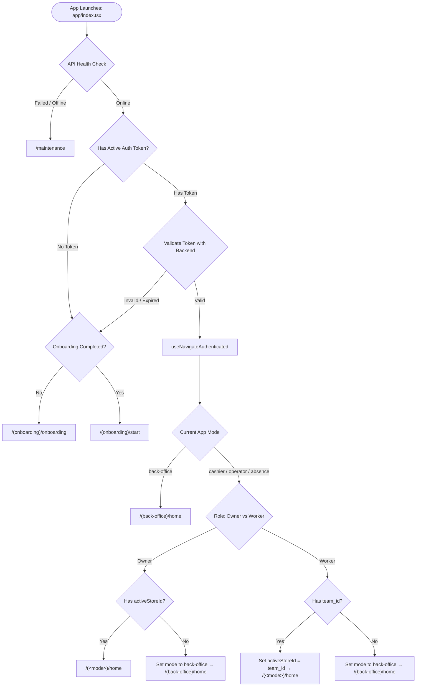

# Rapido App Flow & Navigation Guide

Inventory UI progress, Figma references, mock-data boundaries, and pending modules
are tracked in [`FIGMA_PROGRESS.md`](FIGMA_PROGRESS.md).

This document is the **Single Source of Truth** for the application flow, navigation hierarchy, and layout architecture of the Rapido React Native (Expo) mobile frontend.

> [!IMPORTANT]
> **Maintenance Rule for Developers & AI Agents**:
> Whenever you add, rename, move, or remove a route or layout in `app/`, you **MUST** update this file to keep the navigation tree and flow diagrams synchronized.

---

## 1. High-Level Architecture & Routing Principles

Rapido uses **Expo Router v5** file-based routing with custom navigation primitives and layout patterns:

- **Root Routing**: Everything under [`app/`](file:///d:/Programming/Projects/rapido/frontend/app) defines an addressable route.
- **Stacks with `JSStack`**: Screens within stacks utilize custom transitions (primarily `ScaleBackTransition` for fluid iOS/Android sheet-like scaling transitions).
- **Tab Bars with `BottomTab`**: Mode-level layouts implement custom animated bottom navigation (`components/custom/BottomTab.tsx`).
- **Layout-Level Headers**: In accordance with project architecture, headers **MUST** be declared inside `_layout.tsx` using `JSStack.Screen options={{ header: () => <Header ... /> }}`. `<Header>` is **never** rendered inside screen views.
- **Nested Layout Transparency**: Parent layouts register child feature folders with `options={{ headerShown: false }}` so the parent stack does not intercept or duplicate navigation headers.
- **Screen Containers**: All screens must use `AnimatedWrapper` or `Wrapper` (`@/components/common/Wrapper`), never unstyled raw `<View><ScrollView>`.

---

## 2. Boot, Authentication & Protected Route Lifecycle

When the app boots, it evaluates system health, local stored credentials, and onboarding state before routing the user.

### Flow Diagram



### Key Lifecycle Hooks & Files
- **`app/index.tsx`**: Boot entry point that validates server status (`useApiHealthData`), validates authentication tokens via SecureStore (`Keys.AUTH_TOKEN`), and determines initial navigation.
- **`hooks/useProtectedRoute.ts`**: Global route guard executing in the root layout. Intercepts unauthorized navigation to protected routes (redirecting to `/(onboarding)/login`) and prevents logged-in users from accessing onboarding/auth pages.
- **`hooks/useNavigateAuthenticated.ts`**: Resolves the exact destination route based on the user's role (`owner` vs. team member), current mode (`back-office`, `cashier`, `operator`, `absence`), and active store scope.

---

## 3. Operating Modes & Store Scoping

Rapido divides features into 4 distinct operating modes stored in `useAppModeStore` (`store/appModeStore.ts`):

| Mode | Label | Root Route | Context & Requirements |
| :--- | :--- | :--- | :--- |
| **`back-office`** | Back Office | `app/(back-office)/` | Business-wide analytics, financial accounting, catalog management, team management. Does **not** require a single store scope. |
| **`cashier`** | Kasir | `app/(cashier)/` | Point of Sale (POS), customer carts, billing, table layouts, cashier shift reporting. **Requires an active store**. |
| **`operator`** | Operator | `app/(operator)/` | Kitchen and beverage preparation display system. **Requires an active store**. |
| **`absence`** | Absensi | `app/(absence)/` | Employee attendance clock-in / clock-out terminal. Does **not** require upfront store selection (store is selected directly in the attendance form). |

### Mode Switching Workflow
1. The user taps `AppModeButton` (`components/custom/AppModeButton.tsx`).
2. An Actionsheet presents available modes.
3. If switching to a store-scoped mode (`cashier`, `operator`):
   - **Owners**: A Store Picker Actionsheet prompts the user to select which store outlet to operate. The selection updates `useActiveStore` (`activeStoreId`).
   - **Workers**: Automatically bound to their assigned `team_id`.
4. If switching to `back-office` or `absence`:
   - Switches directly without prompting for a store. (In Absence mode, the store is chosen directly on the attendance submission screen).
5. `switchModeWithTransition(targetMode)` displays `LayoutTransitionSplash`, switches the store state, and navigates via `router.replace()`.

---

## 4. Complete Navigation Tree

Below is the directory map of all routes and layouts.

```text
app/
├── _layout.tsx                     # Root provider stack (QueryClient, Auth, Gluestack, Fonts)
├── index.tsx                       # Splash / Health check / Auth bootstrapper
├── +not-found.tsx                  # 404 Not Found fallback screen
│
├── (onboarding)/                   # Public & Onboarding flow
│   ├── _layout.tsx                 # JSStack for onboarding & auth screens
│   ├── onboarding.tsx              # Welcome carousel
│   ├── start.tsx                   # Get started landing page
│   ├── login.tsx                   # User login
│   ├── otp.tsx                     # OTP phone verification
│   ├── forgot-password.tsx         # Password reset request
│   ├── reset-password.tsx          # New password setup
│   ├── register/                   # User & business registration
│   │   ├── _layout.tsx             # JSStack
│   │   ├── index.tsx               # Account credentials step
│   │   └── wizard.tsx              # Business profile setup wizard
│   └── choose-store/               # Initial store selection
│       ├── _layout.tsx             # JSStack
│       ├── index.tsx               # Store list selection
│       ├── create.tsx              # Create first store
│       └── pin.tsx                 # Store security PIN entry
│
├── (back-office)/                  # Back Office Mode (5 Bottom Tabs)
│   ├── _layout.tsx                 # Tab Bar layout (BottomTab)
│   ├── home/                       # Tab 1: Beranda (Home)
│   │   ├── _layout.tsx             # JSStack
│   │   ├── index.tsx               # Dashboard & sales summary
│   │   ├── transaction.tsx         # Daily transaction details
│   │   └── transaction-history.tsx # Filterable transaction logs
│   ├── report/                     # Tab 2: Laporan (Reports Hub)
│   │   ├── _layout.tsx             # JSStack
│   │   └── index.tsx               # Hub for all business reports
│   ├── catalog/                    # Tab 3: Katalog (Master Catalog Hub)
│   │   ├── _layout.tsx             # JSStack
│   │   └── index.tsx               # Catalog items & settings dashboard
│   ├── inventory/                  # Tab 4: Inventory (Stock Hub)
│   │   ├── _layout.tsx             # JSStack
│   │   ├── index.tsx               # Persediaan hub (Figma inventory menu)
│   │   └── summary.tsx             # Bahan Baku / Produk summary; keeps bottom tabs
│   └── manage.tsx                  # Tab 5: Kelola (Business & Hardware Settings Hub)
│
├── (cashier)/                      # Cashier Mode (5 Bottom Tabs)
│   ├── _layout.tsx                 # Tab Bar layout (BottomTab)
│   ├── home/                       # Tab 1: Beranda (POS Checkout)
│   │   └── index.tsx               # POS register grid & quick cart
│   ├── report/                     # Tab 2: Laporan (Shift & Daily Report)
│   │   ├── _layout.tsx             # JSStack
│   │   ├── index.tsx               # Active shift sales summary
│   │   └── history.tsx             # Past shift reports
│   ├── catalog.tsx                 # Tab 3: Dummy tab redirecting to /(no-layout)/(cashier)/catalog
│   ├── location/                   # Tab 4: Tempat (Table & Dining Rooms)
│   │   └── index.tsx               # Table layout & dine-in occupancy
│   └── biling/                     # Tab 5: Tagihan (Open Bills)
│       ├── _layout.tsx             # JSStack
│       └── index.tsx               # Unpaid bills & open orders list
│
├── (operator)/                     # Operator Mode (Kitchen / Bar Display)
│   ├── _layout.tsx                 # JSStack (home, detail)
│   ├── home.tsx                    # Live orders queue & fulfillment cards (Baru, Diproses, Selesai)
│   └── detail.tsx                  # Order items preparation checklist & completion
│
├── (absence)/                      # Absence Mode (Attendance Terminal)
│   ├── _layout.tsx                 # JSStack for absence screens
│   ├── home.tsx                    # Clock-in / clock-out dashboard & menu favorit
│   ├── record.tsx                  # Clock-in & clock-out form (store, selfie, location)
│   └── camera.tsx                  # Selfie camera viewfinder screen
│
└── (no-layout)/                    # Modal, Sub-flow & Fullscreen Stacks
    ├── _layout.tsx                 # Root JSStack for all non-tabbed flows
    ├── maintenance.tsx             # Public system maintenance screen
    ├── terms-and-condition.tsx     # Terms & Conditions viewer
    │
    ├── home/
    │   ├── _layout.tsx
    │   └── input-kas.tsx           # Cash In / Cash Out (Petty cash modal)
    │
    ├── inventory/                  # Inventory flows without bottom tabs
    │   ├── _layout.tsx             # Children registered with headerShown: false
    │   ├── stock-transfer/         # Transfer Stok
    │   │   ├── _layout.tsx         # Layout-level list, create and detail headers
    │   │   ├── index.tsx           # Search, store filter and stock-kind tabs
    │   │   ├── modify.tsx          # Validated stock transfer form
    │   │   └── detail.tsx          # Transfer information and transferred items
    │   ├── stock-adjustment/       # Penyesuaian Stok
    │   │   ├── _layout.tsx
    │   │   ├── index.tsx           # Search, store filter and stock-kind tabs
    │   │   ├── modify.tsx          # Shrinkage form; derives remaining stock
    │   │   └── detail.tsx          # Stock totals and good / damaged quantities
    │   ├── purchase-order/         # Pembelian Barang
    │   │   ├── _layout.tsx
    │   │   ├── index.tsx           # Purchase status tabs, search and actions
    │   │   ├── modify.tsx          # Purchase form with quantity / price subtotals
    │   │   └── detail.tsx          # Purchase information and item totals
    │   └── suppliers/             # Pemasok
    │       ├── _layout.tsx         # Layout-level list, create/edit and detail headers
    │       ├── index.tsx           # Search, supplier filters and purchase totals
    │       ├── modify.tsx          # Contact/address form; session-only CRUD
    │       └── detail.tsx          # Supplier information, edit and guarded delete
    │
    ├── (back-office)/              # Back Office specific sub-flows
    │   ├── _layout.tsx             # JSStack
    │   ├── manage/                 # Business Administration
    │   │   ├── _layout.tsx
    │   │   ├── account/            # Account & store owner settings
    │   │   │   ├── _layout.tsx
    │   │   │   ├── index.tsx
    │   │   │   ├── modify-owner.tsx
    │   │   │   └── modify-business.tsx
    │   │   ├── roles/              # Role / Hak Akses: CRUD backend, pencarian, permission; akses owner
    │   │   │   ├── _layout.tsx
    │   │   │   ├── index.tsx
    │   │   │   ├── detail.tsx
    │   │   │   └── modify.tsx
    │   │   └── generate-barcode/   # Barcode creation & label management
    │   │       ├── _layout.tsx
    │   │       ├── index.tsx
    │   │       ├── modify.tsx
    │   │       └── detail.tsx
    │   └── report/                 # Detailed Analytical Reports
    │       ├── summary.tsx         # Business summary report
    │       ├── operational-team.tsx# Staff & operational performance
    │       ├── purchase-supplier.tsx # Purchases & supplier expenses
    │       ├── product-stock.tsx   # Product turnover & stock audit
    │       ├── cash.tsx            # Cash movements & registers
    │       ├── customers-promos.tsx# Customer loyalty & promo usage
    │       ├── sales.tsx           # Sales volume & profit analysis
    │       ├── transaction.tsx     # Full transaction history
    │       └── accounting/         # Financial Accounting Suite
    │           ├── _layout.tsx     # JSStack for accounting features
    │           ├── index.tsx       # Accounting overview hub
    │           ├── balance-sheet.tsx   # Neraca (Balance Sheet)
    │           ├── profit-loss.tsx     # Laba Rugi (Profit & Loss statement)
    │           ├── capital-changes.tsx # Perubahan Modal (Capital changes)
    │           ├── accounts/       # Saldo Awal Akun (Chart of accounts)
    │           │   ├── _layout.tsx
    │           │   ├── index.tsx
    │           │   ├── modify.tsx
    │           │   └── detail.tsx
    │           ├── expenses/       # Pengeluaran Kas / Biaya
    │           │   ├── _layout.tsx
    │           │   ├── index.tsx
    │           │   ├── modify.tsx
    │           │   └── detail.tsx
    │           ├── incomes/        # Pemasukan Kas
    │           │   ├── _layout.tsx
    │           │   ├── index.tsx
    │           │   ├── modify.tsx
    │           │   ├── detail.tsx
    │           │   └── receipt.tsx
    │           ├── general-journal/ # Jurnal Umum
    │           │   ├── _layout.tsx
    │           │   ├── index.tsx
    │           │   ├── modify.tsx
    │           │   └── detail.tsx
    │           ├── adjusting-journal/ # Jurnal Penyesuaian
    │           │   ├── _layout.tsx
    │           │   ├── index.tsx
    │           │   ├── modify.tsx
    │           │   └── detail.tsx
    │           ├── general-ledger/ # Buku Besar
    │           │   ├── _layout.tsx
    │           │   ├── index.tsx
    │           │   └── detail.tsx
    │           ├── closing-journal/ # Jurnal Penutup
    │           │   ├── _layout.tsx
    │           │   ├── index.tsx
    │           │   ├── modify.tsx
    │           │   └── detail.tsx
    │           └── cash-flow/      # Laporan Arus Kas
    │               ├── _layout.tsx
    │               ├── index.tsx       # Ringkasan Arus Kas
    │               ├── operasi.tsx     # Detail Arus Kas Operasi
    │               ├── investasi.tsx   # Detail Arus Kas Investasi
    │               └── pendanaan.tsx   # Detail Arus Pendanaan
    │
    ├── (cashier)/                  # Cashier specific sub-flows
    │   ├── _layout.tsx             # JSStack
    │   ├── transaction.tsx         # Active transaction management
    │   ├── shift-report.tsx        # End of shift cash count & report
    │   ├── report/                 # Cashier reports & cash out
    │   │   ├── _layout.tsx
    │   │   └── expense-input.tsx   # POS quick expense input
    │   ├── catalog/                # Fullscreen POS Catalog
    │   │   ├── _layout.tsx
    │   │   ├── index.tsx           # Category & product picker
    │   │   ├── detail.tsx          # Item modifier & variant picker
    │   │   └── search.tsx          # Product search modal
    │   └── cart/                   # Checkout & Payment Workflow
    │       ├── _layout.tsx
    │       ├── index.tsx           # Cart breakdown & item discounts
    │       ├── offer.tsx           # Apply voucher / promo / discount
    │       ├── confirm.tsx         # Payment method selection
    │       ├── input-money.tsx     # Cash calculator keypad
    │       └── input-money-confirm.tsx # Payment receipt & change confirmation
    │
    ├── catalog/                    # Master Catalog Entity Management (CRUD)
    │   ├── _layout.tsx             # Master catalog entity JSStack
    │   ├── brand/                  # Merek (_layout, index, modify, detail)
    │   ├── category/               # Kategori (_layout, index, modify, detail)
    │   ├── unit/                   # Satuan Unit (_layout, index, modify, detail)
    │   ├── menu/                   # Menu Produk (_layout, index, modify, detail)
    │   ├── extra-menu/             # Menu Tambahan / Topping (_layout, index, modify, detail)
    │   ├── extra-cost/             # Biaya Tambahan (_layout, index, modify, detail)
    │   ├── bundling/               # Paket Bundling (_layout, index, modify, detail)
    │   ├── tax/                    # Pajak (_layout, index, modify, detail)
    │   ├── order-type/             # Tipe Pesanan (_layout, index, modify, detail)
    │   ├── payment-method/         # Metode Pembayaran (_layout, index, modify, detail)
    │   ├── promo/                  # Promosi (_layout, index, modify, detail)
    │   ├── discount/               # Diskon (_layout, index, modify, detail)
    │   └── voucher/                # Voucher (_layout, index, modify, detail)
    │
    ├── offer/                      # Standalone Offers Management
    │   ├── _layout.tsx
    │   ├── promo/                  # (_layout, index, modify)
    │   ├── discount/               # (_layout, index, modify)
    │   └── voucher/                # (_layout, index, modify)
    │
    ├── manage/                     # Store, Hardware & Data Utilities
    │   ├── _layout.tsx
    │   ├── pin.tsx                 # Security PIN setting modal
    │   ├── pos-settings/           # Pengaturan POS (_layout, index, stock-limit, stock-limit-detail, rounding, rounding-detail, notifications, notification-modify, notification-detail)
    │   ├── printer/                # Thermal printer pairing & config (_layout, index, modify)
    │   ├── store/                  # Store profile & outlet settings (_layout, index, modify, detail)
    │   ├── receipt/                # Tampilan Struk: daftar toko, pengaturan elemen/footer, preview (_layout, index, modify, preview)
    │   ├── workers/                # Karyawan: CRUD owner, role/toko, foto dan scan KTP (_layout, index, detail, modify)
    │   ├── member/                 # Member/pelanggan: CRUD API, pencarian, izin manage customers (_layout, index, detail, modify)
    │   ├── place/                  # Manajemen Tempat: outlet, area, tempat, denah, form (_layout, index, store, area, areas, modify)
    │   ├── backup/                 # Data backup utilities (_layout, index, modify)
    │   ├── export/                 # Data export to Excel/CSV (_layout, index, modify)
    │   ├── extra/                  # Extra settings (_layout, index, modify)
    │   ├── order-type/             # Manage order types (_layout, index, modify)
    │   ├── payment-method/         # Manage payment methods (_layout, index, modify)
    │   ├── tax/                    # Manage taxes (_layout, index, modify)
    │   ├── sales-target/           # Target Penjualan: daftar, detail, tambah/edit produk/kategori (_layout, index, detail, modify)
    │   ├── expenses/               # Biaya & Pengeluaran: daftar/filter, detail, tambah/edit (_layout, index, detail, modify)
    │   ├── income/                 # Pendapatan & Penerimaan: daftar/filter, detail, tambah/edit manual (_layout, index, detail, modify)
    │   ├── payroll/                # Penggajian: daftar, pengaturan, detail, pembayaran, riwayat, slip (_layout, index, modify, detail, payment, history, slip)
    │   ├── absence/                # Absensi (_layout, index)
    │   ├── faq/                    # Bantuan: pencarian, kategori, dan jawaban FAQ (_layout, index)
    │   ├── feature-request/        # Bantuan: form permintaan fitur (_layout, index)
    │   └── feedback/               # Bantuan: form feedback (_layout, index)
    │
    └── order/                      # Order Tracking
        ├── _layout.tsx             # MaterialTopTabs (Paid, Completed, Unpaid)
        ├── index.tsx               # Pesanan Sudah Dibayar
        ├── finished.tsx            # Pesanan Selesai
        ├── unpaid.tsx              # Pesanan Belum Dibayar
        └── ../order-detail/        # Order Receipt & Refund Flow
            ├── _layout.tsx
            ├── index.tsx           # Order details & receipt breakdown
            └── refund.tsx          # Order refund / void authorization
```

---

## 5. Navigation Patterns & Code Conventions

### Standard Navigation Calls
- Use `useRouter()` or `useCustomRouter()` from `expo-router`:
  ```tsx
  import { useRouter } from "expo-router";
  const router = useRouter();

  // Push with params
  router.push({
    pathname: "/(no-layout)/catalog/tax/modify",
    params: { id: "123" },
  });

  // Delayed back for smooth sheet close
  import { delayedBack } from "@/components/custom/JSStack";
  delayedBack();
  ```
- Use `route()` helper from `@/lib/utils` when constructing query URLs:
  ```tsx
  import { route } from "@/lib/utils";
  router.push(route("/(no-layout)/catalog/tax/modify", { id: "123" }));
  ```

### Standard Layout Setup (`_layout.tsx`)
```tsx
import Header from "@/components/common/Header";
import { JSStack, ScaleBackTransition } from "@/components/custom/JSStack";
import { useGlobalSearchParams } from "expo-router";

export default function EntityLayout() {
  const params = useGlobalSearchParams();

  return (
    <JSStack screenOptions={{ ...ScaleBackTransition }}>
      <JSStack.Screen
        name="index"
        options={{ header: () => <Header back title="Daftar Entitas" /> }}
      />
      <JSStack.Screen
        name="modify"
        options={{
          header: () => (
            <Header back title={params?.id ? "Edit Entitas" : "Tambah Entitas"} />
          ),
        }}
      />
    </JSStack>
  );
}
```

---

## 6. Developer & AI Agent Maintenance Protocol

Whenever modifying the route tree:

1. **New Route / Screen**:
   - Create screen under the appropriate domain folder (`app/(no-layout)/...` or `app/(mode)/...`).
   - Register screen in its parent `_layout.tsx`.
   - Update Section 4 (Navigation Tree) of this document to list the new path.
2. **Entity Scaffolding**:
   - Follow the `scaffold-entity-feature` skill.
   - Verify that the new entity directory in `app/(no-layout)/catalog/<entity>/` is added to this document.
3. **Route Deletion or Rename**:
   - Ensure all `router.push()` or `customHref` references are updated across components.
   - Reflect the deletion or rename in this document.

### Tampilan Struk (Kelola)

Alur baru: `/manage/receipt` → `/manage/receipt/modify?id=<store-id>` → `/manage/receipt/preview?id=<store-id>`. Entry point: Kelola → Tampilan Struk. Parent layout menonaktifkan header untuk folder `receipt`; ketiga header berada di `receipt/_layout.tsx`.

- Daftar toko menggunakan `SearchBar`, `CatalogItemCard`, `ItemActionSheet`, dan keadaan pencarian kosong. Sheet menyediakan Preview Struk dan Atur Tampilan Struk.
- Form memakai react-hook-form + `schema/manage/receipt.ts`, 12 toggle elemen, footer maksimal 500 karakter, penghitung perubahan, dan reset ke default. Preview lengkap dapat menampilkan draft sebelum disimpan.
- Komposisi UI ada di `components/feature/manage/receipt/`. Fixture toko dan transaksi ada di `constants/data/manage/receipt.ts`; ID `receipt-demo-*` sengaja tidak memakai ID toko backend.
- `store/receiptStore.ts` memisahkan pengaturan tersimpan dan snapshot preview untuk setiap toko. Pengaturan bertahan selama aplikasi berjalan; belum memakai API/persistensi perangkat dan belum memengaruhi printer/struk transaksi nyata.
- Referensi metadata Figma: daftar `1:28831`, pengaturan `1:19070`/`1:19205`, struk `1:21182`. Pembacaan Figma baru tertahan batas MCP Starter; ilustrasi menggunakan aset receipt yang sudah tersedia. Screenshot implementasi tersimpan di `docs/previews/receipt/`; pencocokan screenshot/style Figma dan validasi perangkat native masih perlu dilakukan.

### Role / Hak Akses (Kelola)

Kelola → `/manage/roles` membuka daftar Role untuk pemilik akun. Tap kartu atau sheet menuju `/manage/roles/detail?id=<id>`; Tambah Role menuju `/manage/roles/modify`, dan Edit memakai `?id=<id>`. Rute berada di `app/(no-layout)/(back-office)/manage/roles/`, menggantikan placeholder lama. Parent mendaftarkan folder dengan header nonaktif; header tiap layar serta guard owner berada di layout Role.

Data Role menggunakan CRUD backend `/contents/roles`; kategori permission memakai `/reference-data/permissions`. Form mempertahankan permission lama, memetakan error validasi, dan memperbarui cache setelah simpan/hapus berhasil. Akun per Role dibaca dari `/contents/workers`, disaring berdasarkan ID Role, dan terhubung ke detail Karyawan. Implementasi, screenshot, perbaikan backend, dan bukti verifikasi dicatat di [ROLES_UI_PROGRESS.md](ROLES_UI_PROGRESS.md).

### Karyawan (Kelola)

Kelola → `/manage/workers` → `/manage/workers/detail?id=<id>`; tambah/edit memakai `/manage/workers/modify` dengan ID opsional. Header dan guard owner berada di layout Karyawan; parent mendaftarkan folder tanpa header tambahan. Daftar mendukung pencarian, refresh, sheet tindakan, dan hapus terkonfirmasi. Form mencakup data pribadi, satu Role/toko, password beserta konfirmasi khusus tambah, foto, dan scan KTP.

Data menggunakan CRUD owner `/contents/workers`, pilihan `/contents/roles` dan `/stores`; simpan/hapus memperbarui cache. Multipart edit memakai POST `_method=PUT`; password dan gambar tersimpan dipertahankan. Status aktif, banyak outlet, rekening, dan riwayat login belum tersedia pada kontrak ini. Lokasi code, perbaikan backend, screenshot, serta hasil pengujian dicatat di [WORKERS_UI_PROGRESS.md](WORKERS_UI_PROGRESS.md).

### Member (Kelola)

Kelola → `/manage/member` → `/manage/member/detail?id=<id>`; tambah/edit memakai `/manage/member/modify` dengan ID opsional. Header dan guard owner/izin `manage customers` berada pada nested layout. Parent mendaftarkan folder tanpa header kedua. Data berasal dari CRUD `/customers/data`, memakai DTO pelanggan dan factory hooks dengan cache `customers`.

Daftar mendukung pencarian nama/telepon/email, refresh, retry, serta sheet detail/edit/hapus. Form menyediakan nama/telepon wajib dan email, nomor KTP, alamat, tanggal lahir, jenis kelamin, serta catatan opsional. Field opsional dapat dikosongkan; error 422 menjaga draft. Data kunjungan, poin, riwayat transaksi, kota, profesi, dan foto belum tersedia pada respons pelanggan. Code, screenshot, dan hasil pengujian ada di [MEMBER_UI_PROGRESS.md](MEMBER_UI_PROGRESS.md).

### Manajemen Tempat (Kelola)

Kelola → `/manage/place` → `/manage/place/store?outletId=<id>` → `/manage/place/area?outletId=<id>&areaId=<id>`. Form area berada pada `/manage/place/areas` (opsional `outletId` dan `areaId` untuk edit); form tempat pada `/manage/place/modify` (wajib `outletId`/`areaId`, opsional `placeId` untuk edit). Parent menonaktifkan header folder; lima header berada pada `place/_layout.tsx`.

- Pencarian outlet, statistik turunan, tab Statistik/Area, daftar tempat, status aktif, tambah/edit beberapa area atau tempat, serta hapus dengan konfirmasi memakai komponen bersama.
- Form memakai react-hook-form + Zod. Nama di-trim dan harus unik dalam outlet/area yang sama; kapasitas berupa bilangan bulat 1–10.000. ID area/tempat diperiksa terhadap outlet yang dipilih.
- Layout Daerah menyediakan grid tiga kolom, drag & drop untuk menukar posisi, pemilih tempat, dan kontrol panah. Draft diterapkan hanya setelah Simpan Layout; penghapusan merapikan posisi sebelum tempat baru ditambahkan.
- Komposisi UI berada di `components/feature/manage/place/`; model, fixture, schema, helper, dan state terpisah pada `types/ui/manage/place.ts`, `constants/data/manage/place.ts`, `schema/manage/place.ts`, `lib/manage/place.ts`, dan `store/placeStore.ts`.
- Data adalah fixture desain dengan ID `place-demo-*`; state hanya bertahan selama aplikasi terbuka, belum API atau persistensi perangkat. Statistik dihitung dari data dan status aktif outlet. Referensi Figma, screenshot implementasi, hasil verifikasi, dan batas preview dicatat di [previews/place/README.md](previews/place/README.md).

### Target Penjualan (Kelola)

Kelola → `/manage/sales-target` menggantikan placeholder dengan daftar target yang dapat dicari. Tap kartu atau sheet membuka `/manage/sales-target/detail?id=<id>`; tambah memakai `/manage/sales-target/modify`, dan edit memakai `?id=<id>`. Parent sudah mendaftarkan folder dengan header nonaktif; tiga header berada pada `sales-target/_layout.tsx`.

- Form react-hook-form + Zod menyimpan nama, periode tanggal, toko, serta target per produk atau kategori. `MultiSelect` mempertahankan nilai pada item yang tetap dipilih. Pergantian toko/tipe mengosongkan rincian yang lama; validasi menolak pilihan dari toko lain dan baris ganda.
- Target produk memakai kuantitas serta nilai, sedangkan kategori memakai nilai. Total nilai adalah jumlah nilai target setiap baris dan tidak menunjukkan capaian transaksi. Nama unik per toko, periode harus valid dan berurutan, kuantitas integer minimal 1, dan nilai Rupiah bulat minimal 1.
- Simpan pertama menghasilkan ID lokal yang dipakai kembali pada penyimpanan selanjutnya agar tidak menggandakan target. Daftar/detail menyediakan hapus dengan konfirmasi. ID detail/edit yang tidak ditemukan tidak membuka form baru.
- Model, fixture, schema, helper, state, dan komposisi berada pada `types/ui/manage/sales-target.ts`, `constants/data/manage/sales-target.ts`, `schema/manage/sales-target.ts`, `lib/manage/sales-target.ts`, `store/salesTargetStore.ts`, serta `components/feature/manage/sales-target/`.
- Data/state bersifat lokal selama aplikasi berjalan, belum API, persistensi perangkat, atau penghitungan capaian penjualan. Screenshot, referensi Figma, hasil verifikasi, dan batas preview ada pada [previews/sales-target/README.md](previews/sales-target/README.md).

### Biaya & Pengeluaran (Kelola)

Kelola → `/manage/expenses` membuka daftar pengeluaran yang dikelompokkan per tanggal. Tap kartu atau sheet menuju `/manage/expenses/detail?id=<id>`; tambah memakai `/manage/expenses/modify`, dan edit memakai `?id=<id>`. Parent sudah mendaftarkan `expenses` tanpa header tambahan; tiga header berada di `expenses/_layout.tsx`.

- Pencarian mencakup referensi, akun, deskripsi, sumber dana, pembuat, dan toko. Filter sumber dana/toko dapat digabungkan, dengan reset serta total yang dihitung dari hasil filter. Daftar hanya memuat `type: expense`; penyesuaian saldo masuk pada fixture lama tetap berada di laporan.
- Form RHF/Zod memvalidasi akun/kode, referensi unik per toko, sumber dana, toko, tanggal kalender ISO `YYYY-MM-DD`, nominal Rupiah bulat positif, dan deskripsi. Kode mengikuti akun dan tidak dapat diketik. Tanggal berformat Indonesia dari form laporan lama dinormalisasi saat edit. Metadata pembuat/jam dipertahankan saat edit; penambahan melalui desain ini diberi pembuat `Pratinjau lokal`.
- State memakai `useAccountingStore` serta tipe/fixture akuntansi yang sudah ada, sehingga simpan/hapus terbaca oleh layar laporan tanpa membuat koleksi data kedua. Simpan berulang memakai ID pertama; ID hilang atau milik saldo masuk diblokir. Hapus memerlukan konfirmasi. Alokasi ID `addExpense` memakai suffix jika timestamp sudah digunakan; action akuntansi lain tidak diubah.
- Schema berada di `schema/manage/expense.ts`; helper tanggal/simpan/filter di `lib/manage/expense-date.ts` dan `lib/manage/expenses.ts`; komposisi form/detail di `components/feature/manage/expenses/`. Data masih fixture/state lokal selama aplikasi berjalan, belum API atau persistensi perangkat. Referensi, screenshot, hasil, dan batas verifikasi ada pada [previews/expenses/README.md](previews/expenses/README.md).

### Pendapatan & Penerimaan (Kelola)

Kelola → `/manage/income` membuka daftar yang dikelompokkan per tanggal, dengan pencarian, filter sumber dana/toko/jenis, reset, dan total hasil filter. Detail berada pada `/manage/income/detail?id=<id>`; tambah manual pada `/manage/income/modify`; edit memakai ID penerimaan manual. Parent sudah mendaftarkan income tanpa header tambahan; header ketiga layar berada di `income/_layout.tsx`.

- Penerimaan manual mendukung tambah/edit/hapus terkonfirmasi. Penerimaan invoice berasal dari penjualan dan ditampilkan sebagai informasi, dengan nominal/jumlah item dari record penerimaan. Daftar/detail tidak menyediakan edit/hapus invoice; route edit dan helper mutation juga menjaganya. Receipt fixture lama tidak cocok dengan nomor/tanggal/nominal penerimaan dan tidak ditampilkan sebagai struk transaksi ini.
- Form RHF/Zod memakai pilihan akun/kode yang cocok, referensi unik per toko (termasuk referensi invoice), sumber dana/toko, tanggal kalender ISO, Rupiah bulat positif, serta deskripsi. Metadata pembuat/jam dipertahankan saat edit. ID hasil simpan pertama dipakai untuk simpan berikutnya; penambahan berdekatan mendapat ID berbeda. Input tanggal Indonesia dari form laporan lama dinormalisasi saat edit. Data opsional yang hilang tetap kosong/dash.
- Form bersama ada pada `components/feature/accounting/CashEntryForm.tsx`; wrapper Expense/Income hanya memasok kind, nilai awal, dan ID. Schema bersama `schema/accounting/cash-entry.ts` memakai konfigurasi pilihan tiap modul. `lib/accounting/date.ts` menampung validasi/format tanggal; `lib/manage/expense-date.ts` mempertahankan export lama. Form/schema laporan lama tidak diubah.
- Data memakai koleksi `incomes` dari `accountingStore` serta tipe/fixture yang sudah tersedia; tidak membuat mode dummy global atau fixture baru. State masih lokal selama aplikasi berjalan, belum API/persistensi/jurnal/saldo otomatis. Schema/helper income berada di `schema/manage/income.ts` dan `lib/manage/incomes.ts`; komposisi detail/form di `components/feature/manage/income/`. Referensi dan batas verifikasi ada di [previews/income/README.md](previews/income/README.md).

### Penggajian (Kelola)

Kelola → `/manage/payroll` membuka pratinjau daftar karyawan dengan pencarian nama/peran/metode, filter periode/status pembayaran, reset, dan total hasil filter. Record periode yang sama dipakai oleh `/manage/payroll/detail?id=<id>`, `/modify?id=<id>`, `/payment?id=<id>`, `/history?id=<id>`, dan `/slip?id=<id>`. Header keenam layar berada pada `payroll/_layout.tsx`; parent sudah mendaftarkan payroll tanpa header tambahan.

- Pengaturan RHF/Zod mendukung Bulanan, Harian, Per Jam, dan Per Layanan. Penghasilan dihitung dari komponen tetap atau aktivitas × tarif/komisi, lalu bonus dikurangi potongan dan kasbon. Nominal Rupiah harus bulat dan terbatas; tanggal memakai kalender ISO. Contoh layanan 12/20/30/15 menghasilkan 77 layanan dan Rp1.500.000, mengikuti perhitungan record.
- Catat pembayaran penuh/sebagian memperbarui total dibayar, sisa, dan status pada detail/daftar/slip. Pembayaran penuh harus melunasi sisa; pembayaran berlebih, referensi ganda, tanggal sebelum periode, ID hilang, serta pembayaran pada periode lunas ditolak. Transfer memerlukan tujuan. Simpan pertama mengunci form dan beralih ke slip, sehingga tidak menambah pembayaran kedua. Pengaturan dan bonus/potongan/kasbon dikunci setelah pembayaran pertama.
- Riwayat penghasilan hanya menampilkan periode karyawan yang dipilih; riwayat pembayaran memakai record periode tersebut. Unduhan web berupa HTML UTF-8 yang dapat dicetak melalui browser; native membagikan teks slip. Slip memakai rincian/penyesuaian/pembayaran yang sama dan diberi penanda pratinjau.
- Tipe, fixture, schema, helper, dan store terpisah pada `types/ui/manage/payroll.ts`, `constants/data/manage/payroll.ts`, `schema/manage/payroll.ts`, `lib/manage/payroll.ts`, `lib/manage/payroll-slip.ts`, dan `store/payrollStore.ts`; komposisi pada `components/feature/manage/payroll/`. Data contoh hanya milik fitur ini, tanpa mengganti mode aplikasi/API/auth global. State sementara selama aplikasi berjalan; belum API/persistensi, data karyawan/absensi/pekerjaan nyata, pajak/prorata, transfer uang, atau jurnal/saldo otomatis. Referensi, hasil verifikasi, dan batas pratinjau ada di [previews/payroll/README.md](previews/payroll/README.md).
