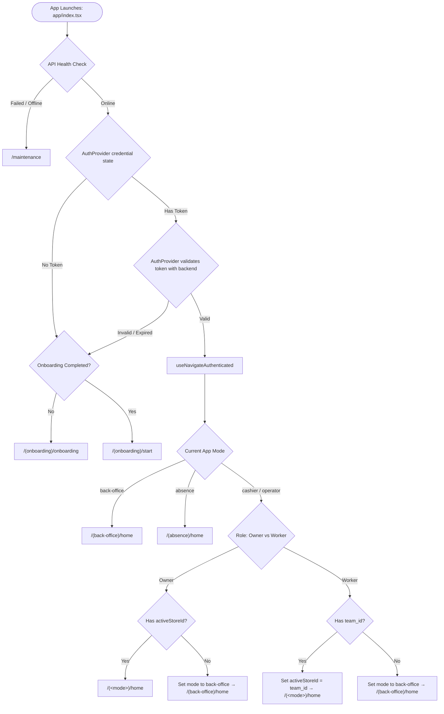

# Rapido App Flow & Navigation Guide

Inventory UI progress, Figma references, mock-data boundaries, and pending modules
are tracked in [`FIGMA_PROGRESS.md`](FIGMA_PROGRESS.md).

This document is the **Single Source of Truth** for the application flow, navigation hierarchy, and layout architecture of the Rapido React Native (Expo) mobile frontend.

> [!IMPORTANT]
> **Maintenance Rule for Developers & AI Agents**:
> Whenever you add, rename, move, or remove a route or layout in `app/`, you **MUST** update this file to keep the navigation tree and flow diagrams synchronized.

---

## 1. High-Level Architecture & Routing Principles

Rapido uses **Expo Router v5** file-based routing with custom navigation primitives and layout patterns:

- **Root Routing**: Everything under [`app/`](file:///d:/Programming/Projects/rapido/frontend/app) defines an addressable route.
- **Stacks with `JSStack`**: Screens within stacks utilize custom transitions (primarily `ScaleBackTransition` for fluid iOS/Android sheet-like scaling transitions).
- **Tab Bars with `BottomTab`**: Mode-level layouts implement custom animated bottom navigation (`components/custom/BottomTab.tsx`).
- **Layout-Level Headers**: In accordance with project architecture, headers **MUST** be declared inside `_layout.tsx` using `JSStack.Screen options={{ header: () => <Header ... /> }}`. `<Header>` is **never** rendered inside screen views.
- **Nested Layout Transparency**: Parent layouts register child feature folders with `options={{ headerShown: false }}` so the parent stack does not intercept or duplicate navigation headers.
- **Screen Containers**: All screens must use `AnimatedWrapper` or `Wrapper` (`@/components/common/Wrapper`), never unstyled raw `<View><ScrollView>`.

---

## 2. Boot, Authentication & Protected Route Lifecycle

When the app boots, `AuthProvider` loads and validates stored credentials while `app/index.tsx` checks system health and onboarding state. Boot waits for the provider's auth result, a known destination, and a minimum splash duration of 850 ms. It does not start a second token-validation request. The outro callback uses the latest committed destination once; pending health/auth checks and unmount invalidate it. Revoking readiness creates a fresh splash instance, and callbacks from the old instance cannot complete the recovered session.

### Flow Diagram



### Key Lifecycle Hooks & Files
- **`app/index.tsx`**: Boot entry point that reads server status (`useApiHealthData`), the `AuthProvider` result, and the current onboarding-completion snapshot to determine navigation after splash. Stored-token validation belongs to `context/AuthContext.tsx`; expired tokens follow the provider's anonymous state. Onboarding storage is rechecked on boot renders (health/auth/timer), not subscribed to native storage changes.
- **`context/AuthContext.tsx`**: Loads `Keys.AUTH_TOKEN` from storage, refetches `/user`, and exposes `isLoading` and `authenticated`. Boot waits for this lifecycle instead of retrying validation from its own effect. Bootstrap ignores storage results after effect cleanup; `reloadAuth` activates loading explicitly. Token updates propagate failed user validation to the login caller using `throwOnError`; developer evidence and review bounds are in [SD5-005](qa/senior-5-2026-10-09/auth-refetch/HANDOFF.md).
- **`api/hooks/auth.ts` — `useLoginRequest`**: Locks each login instance before awaiting POST `/login` and keeps loading active until `AuthProvider.updateToken` completes. Responses after the login screen unmounts do not start auth updates or write form errors; an auth update already started may finish. Backend errors and auth-update failures allow retry. Developer verification and review bounds are recorded in [SD5-003](qa/senior-5-2026-10-09/login/HANDOFF.md).
- **`api/hooks/registration.ts` / `PersonalInfoAction.tsx`**: Locks registration-start submissions and preserves cooldown/validation messages. Each open confirmation sheet has its own request lifetime; closed-sheet responses do not change OTP state or navigate. Active success stores the submitted personal-info snapshot and opens OTP once. This covers `/register/start`; OTP verification and final registration remain separate. Developer evidence and review bounds are in [SD5-006](qa/senior-5-2026-10-09/registration-start/HANDOFF.md).
- **`app/(onboarding)/otp.tsx` / `api/hooks/otp.ts`**: Resend uses the existing registration-start endpoint with a synchronous lock, one feedback, validated server429 countdown and session lifetime checks. Changing the personal-info/verify-response resets the OTP input; late results cannot replace a new session. The screen uses Wrapper for keyboard/scroll and explicit feedback because OTP verification is still unavailable. Developer evidence and runtime/review limits are in [SD5-007](qa/senior-5-2026-10-09/otp-resend/HANDOFF.md).
- **`hooks/useRegistrationForm.ts`**: Restores validated personal/bank/password seeds once per mount and chooses the earliest incomplete step. Later seed changes preserve the current draft/index. Shared terms acceptance remains live in both directions with a cleaned-up RHF subscription; route parameters cannot grant acceptance. This is seed restoration, with OTP verification/final registration still separate. Current hook dependency review for Wizard/SD5-006 is recorded in [SD5-008](qa/senior-5-2026-10-09/registration-form/HANDOFF.md).
- **`hooks/useProtectedRoute.ts`**: Global route guard executing in the root layout. Intercepts unauthorized navigation to protected routes (redirecting to `/(onboarding)/login`) and prevents logged-in users from accessing onboarding/auth pages. Effect cleanup cancels scheduled redirect frames and invalidates callbacks delivered after auth/loading/segments change or unmount. Route policy and destinations are preserved; developer evidence and runtime bounds are in [SD5-004](qa/senior-5-2026-10-09/guard/HANDOFF.md).
- **`hooks/useNavigateAuthenticated.ts`**: Resolves the exact destination route based on the user's role (`owner` vs. team member), current mode (`back-office`, `cashier`, `operator`, `absence`), and active store scope.

---

## 3. Operating Modes & Store Scoping

Rapido divides features into 4 distinct operating modes stored in `useAppModeStore` (`store/appModeStore.ts`):

| Mode | Label | Root Route | Context & Requirements |
| :--- | :--- | :--- | :--- |
| **`back-office`** | Back Office | `app/(back-office)/` | Business-wide analytics, financial accounting, catalog management, team management. Does **not** require a single store scope. |
| **`cashier`** | Kasir | `app/(cashier)/` | Point of Sale (POS), customer carts, billing, table layouts, cashier shift reporting. **Requires an active store**. |
| **`operator`** | Operator | `app/(operator)/` | Kitchen and beverage preparation display system. **Requires an active store**. |
| **`absence`** | Absensi | `app/(absence)/` | Employee attendance clock-in / clock-out terminal. Does **not** require upfront store selection (store is selected directly in the attendance form). |

### Mode Switching Workflow
1. The user taps `AppModeButton` (`components/custom/AppModeButton.tsx`).
2. An Actionsheet presents available modes.
3. If switching to a store-scoped mode (`cashier`, `operator`):
   - **Owners**: A Store Picker Actionsheet prompts the user to select which store outlet to operate. The selection updates `useActiveStore` (`activeStoreId`).
   - **Workers**: Automatically bound to their assigned `team_id`.
4. If switching to `back-office` or `absence`:
   - Switches directly without prompting for a store. (In Absence mode, the store is chosen directly on the attendance submission screen).
5. `switchModeWithTransition(targetMode)` displays `LayoutTransitionSplash`, switches the store state, and navigates via `router.replace()`.

---

## 4. Complete Navigation Tree

Below is the directory map of all routes and layouts.

```text
app/
├── _layout.tsx                     # Root provider stack (QueryClient, Auth, Gluestack, Fonts)
├── index.tsx                       # Splash / Health check / Auth bootstrapper
├── +not-found.tsx                  # 404 Not Found fallback screen
│
├── (onboarding)/                   # Public & Onboarding flow
│   ├── _layout.tsx                 # JSStack for onboarding & auth screens
│   ├── onboarding.tsx              # Welcome carousel
│   ├── start.tsx                   # Get started landing page
│   ├── login.tsx                   # User login
│   ├── otp.tsx                     # OTP phone verification
│   ├── forgot-password.tsx         # Password reset request
│   ├── reset-password.tsx          # New password setup
│   ├── register/                   # User & business registration
│   │   ├── _layout.tsx             # JSStack
│   │   ├── index.tsx               # Account credentials step
│   │   └── wizard.tsx              # Business profile setup wizard
│   └── choose-store/               # Initial store selection
│       ├── _layout.tsx             # JSStack
│       ├── index.tsx               # Store list selection
│       ├── create.tsx              # Create first store
│       └── pin.tsx                 # Store security PIN entry
│
├── (back-office)/                  # Back Office Mode (5 Bottom Tabs)
│   ├── _layout.tsx                 # Tab Bar layout (BottomTab)
│   ├── home/                       # Tab 1: Beranda (Home)
│   │   ├── _layout.tsx             # JSStack
│   │   ├── index.tsx               # Dashboard & sales summary
│   │   ├── transaction.tsx         # Daily transaction details
│   │   └── transaction-history.tsx # Filterable transaction logs
│   ├── report/                     # Tab 2: Laporan (Reports Hub)
│   │   ├── _layout.tsx             # JSStack
│   │   └── index.tsx               # Hub for all business reports
│   ├── catalog/                    # Tab 3: Katalog (Master Catalog Hub)
│   │   ├── _layout.tsx             # JSStack
│   │   └── index.tsx               # Catalog items & settings dashboard
│   ├── inventory/                  # Tab 4: Inventory (Stock Hub)
│   │   ├── _layout.tsx             # JSStack
│   │   ├── index.tsx               # Persediaan hub (Figma inventory menu)
│   │   ├── summary.tsx             # Bahan Baku / Produk summary; keeps bottom tabs
│   │   └── closing-stock.tsx       # Stok Akhir; category/search/status/store report with bottom tabs
│   └── manage.tsx                  # Tab 5: Kelola (Business & Hardware Settings Hub)
│
├── (cashier)/                      # Cashier Mode (5 Bottom Tabs)
│   ├── _layout.tsx                 # Tab Bar layout (BottomTab)
│   ├── home/                       # Tab 1: Beranda (POS Checkout)
│   │   └── index.tsx               # POS register grid & quick cart
│   ├── report/                     # Tab 2: Laporan (Shift & Daily Report)
│   │   ├── _layout.tsx             # JSStack
│   │   ├── index.tsx               # Active shift sales summary
│   │   └── history.tsx             # Past shift reports
│   ├── catalog.tsx                 # Tab 3: Dummy tab redirecting to /(no-layout)/(cashier)/catalog
│   ├── location/                   # Tab 4: Tempat (Table & Dining Rooms)
│   │   └── index.tsx               # Table layout & dine-in occupancy
│   └── biling/                     # Tab 5: Tagihan (Open Bills)
│       ├── _layout.tsx             # JSStack
│       └── index.tsx               # Unpaid bills & open orders list
│
├── (operator)/                     # Operator Mode (Kitchen / Bar Display)
│   ├── _layout.tsx                 # JSStack (home, detail)
│   ├── home.tsx                    # Live orders queue & fulfillment cards (Baru, Diproses, Selesai)
│   └── detail.tsx                  # Order items preparation checklist & completion
│
├── (absence)/                      # Absence Mode (Attendance Terminal)
│   ├── _layout.tsx                 # JSStack for absence screens
│   ├── home.tsx                    # Clock-in / clock-out dashboard & menu favorit
│   ├── record.tsx                  # Clock-in & clock-out form (store, selfie, location)
│   ├── camera.tsx                  # Selfie camera viewfinder screen
│   └── history/                    # Riwayat mode Absensi, read-only preview/session data
│       ├── _layout.tsx             # List/detail headers, index anchor, mode-safe back/fallback
│       ├── index.tsx               # Date groups, search/status/store filters and reset
│       └── detail.tsx              # Current record by opaque ID; missing/live state
│
└── (no-layout)/                    # Modal, Sub-flow & Fullscreen Stacks
    ├── _layout.tsx                 # Root JSStack for all non-tabbed flows
    ├── maintenance.tsx             # Public system maintenance screen
    ├── terms-and-condition.tsx     # Terms & Conditions viewer
    │
    ├── home/
    │   ├── _layout.tsx
    │   └── input-kas.tsx           # Cash In / Cash Out (Petty cash modal)
    │
    ├── inventory/                  # Inventory flows without bottom tabs
    │   ├── _layout.tsx             # Children registered with headerShown: false
    │   ├── stock-transfer/         # Transfer Stok
    │   │   ├── _layout.tsx         # Layout-level list, create and detail headers
    │   │   ├── index.tsx           # Search, store filter and stock-kind tabs
    │   │   ├── modify.tsx          # Validated stock transfer form
    │   │   └── detail.tsx          # Transfer information and transferred items
    │   ├── stock-adjustment/       # Penyesuaian Stok
    │   │   ├── _layout.tsx
    │   │   ├── index.tsx           # Search, store filter and stock-kind tabs
    │   │   ├── modify.tsx          # Shrinkage form; derives remaining stock
    │   │   └── detail.tsx          # Stock totals and good / damaged quantities
    │   ├── purchase-order/         # Pembelian Barang
    │   │   ├── _layout.tsx
    │   │   ├── index.tsx           # Purchase status tabs, search and actions
    │   │   ├── modify.tsx          # Purchase form with quantity / price subtotals
    │   │   └── detail.tsx          # Purchase information and item totals
    │   ├── bill-payments/         # Pembayaran Tagihan
    │   │   ├── _layout.tsx         # Layout-level payment list/form/detail headers
    │   │   ├── index.tsx           # Search, supplier filter and live balance totals
    │   │   ├── modify.tsx          # Multi-PO payment/discount; validates latest outstanding
    │   │   └── detail.tsx          # Payment snapshots, purchase links, edit and confirmed delete
    │   ├── suppliers/             # Pemasok
    │   │   ├── _layout.tsx         # Layout-level list, create/edit and detail headers
    │   │   ├── index.tsx           # Search, supplier filters and purchase totals
    │   │   ├── modify.tsx          # Contact/address form; session-only CRUD
    │   │   └── detail.tsx          # Supplier information, edit and guarded delete
    │   ├── materials/             # Bahan Baku
    │   │   ├── _layout.tsx         # Layout-level list, create/edit and detail headers
    │   │   ├── index.tsx           # Search, store/status filters and stock counts
    │   │   ├── modify.tsx          # Validated multi-store material form; session-only CRUD
    │   │   └── detail.tsx          # Stock/location metrics, recent movements and guarded delete
    │   └── compositions/          # Komposisi Produk
    │       ├── _layout.tsx         # Layout-level list, recipe and detail headers
    │       ├── index.tsx           # Product search, recipe-status filter and counts
    │       ├── modify.tsx          # Recipe ingredients/amount/unit cost per portion
    │       └── detail.tsx          # Recipe cost/margin, portion simulation and confirmed delete
    │
    ├── (back-office)/              # Back Office specific sub-flows
    │   ├── _layout.tsx             # JSStack
    │   ├── manage/                 # Business Administration
    │   │   ├── _layout.tsx
    │   │   ├── account/            # Account & store owner settings
    │   │   │   ├── _layout.tsx
    │   │   │   ├── index.tsx
    │   │   │   ├── modify-owner.tsx
    │   │   │   └── modify-business.tsx
    │   │   ├── roles/              # Role / Hak Akses: CRUD backend, pencarian, permission; akses owner
    │   │   │   ├── _layout.tsx
    │   │   │   ├── index.tsx
    │   │   │   ├── detail.tsx
    │   │   │   └── modify.tsx
    │   │   └── generate-barcode/   # Barcode creation & label management
    │   │       ├── _layout.tsx
    │   │       ├── index.tsx
    │   │       ├── modify.tsx
    │   │       └── detail.tsx
    │   └── report/                 # Detailed Analytical Reports
    │       ├── summary.tsx         # Business summary report
    │       ├── operational-team.tsx# Staff & operational performance
    │       ├── purchase-supplier.tsx # Purchases & supplier expenses
    │       ├── product-stock.tsx   # Product turnover & stock audit
    │       ├── cash.tsx            # Cash movements & registers
    │       ├── customers-promos.tsx# Customer loyalty & promo usage
    │       ├── sales.tsx           # Sales volume & profit analysis
    │       ├── transaction.tsx     # Full transaction history
    │       └── accounting/         # Financial Accounting Suite
    │           ├── _layout.tsx     # JSStack for accounting features
    │           ├── index.tsx       # Accounting overview hub
    │           ├── trial-balance.tsx   # Neraca Saldo: saldo sesi per mata uang/filter
    │           ├── balance-sheet.tsx   # Neraca (Balance Sheet)
    │           ├── profit-loss.tsx     # Laba Rugi (Profit & Loss statement)
    │           ├── capital-changes.tsx # Perubahan Modal (Capital changes)
    │           ├── accounts/       # Saldo Awal Akun (Chart of accounts)
    │           │   ├── _layout.tsx
    │           │   ├── index.tsx
    │           │   ├── modify.tsx
    │           │   └── detail.tsx
    │           ├── expenses/       # Pengeluaran Kas / Biaya
    │           │   ├── _layout.tsx
    │           │   ├── index.tsx
    │           │   ├── modify.tsx
    │           │   └── detail.tsx
    │           ├── incomes/        # Pemasukan Kas
    │           │   ├── _layout.tsx
    │           │   ├── index.tsx
    │           │   ├── modify.tsx
    │           │   ├── detail.tsx
    │           │   └── receipt.tsx
    │           ├── general-journal/ # Jurnal Umum
    │           │   ├── _layout.tsx
    │           │   ├── index.tsx
    │           │   ├── modify.tsx
    │           │   └── detail.tsx
    │           ├── adjusting-journal/ # Jurnal Penyesuaian
    │           │   ├── _layout.tsx
    │           │   ├── index.tsx
    │           │   ├── modify.tsx
    │           │   └── detail.tsx
    │           ├── general-ledger/ # Buku Besar
    │           │   ├── _layout.tsx
    │           │   ├── index.tsx
    │           │   └── detail.tsx
    │           ├── closing-journal/ # Jurnal Penutup
    │           │   ├── _layout.tsx
    │           │   ├── index.tsx
    │           │   ├── modify.tsx
    │           │   └── detail.tsx
    │           └── cash-flow/      # Laporan Arus Kas
    │               ├── _layout.tsx
    │               ├── index.tsx       # Ringkasan Arus Kas
    │               ├── operasi.tsx     # Detail Arus Kas Operasi
    │               ├── investasi.tsx   # Detail Arus Kas Investasi
    │               └── pendanaan.tsx   # Detail Arus Pendanaan
    │
    ├── (cashier)/                  # Cashier specific sub-flows
    │   ├── _layout.tsx             # JSStack
    │   ├── transaction.tsx         # Active transaction management
    │   ├── shift-report.tsx        # End of shift cash count & report
    │   ├── report/                 # Cashier reports & cash out
    │   │   ├── _layout.tsx
    │   │   └── expense-input.tsx   # POS quick expense input
    │   ├── catalog/                # Fullscreen POS Catalog
    │   │   ├── _layout.tsx         # Owns Katalog, Detail Pesanan and Cari/back headers
    │   │   ├── index.tsx           # Category & product picker
    │   │   ├── detail.tsx          # Item modifier & variant picker
    │   │   └── search.tsx          # Product search modal
    │   └── cart/                   # Checkout & Payment Workflow
    │       ├── _layout.tsx
    │       ├── index.tsx           # Cart breakdown & item discounts
    │       ├── offer.tsx           # Apply voucher / promo / discount
    │       ├── confirm.tsx         # Payment method selection
    │       ├── input-money.tsx     # Cash calculator keypad
    │       └── input-money-confirm.tsx # Payment receipt & change confirmation
    │
    ├── catalog/                    # Master Catalog Entity Management (CRUD)
    │   ├── _layout.tsx             # Master catalog entity JSStack
    │   ├── brand/                  # Merek (_layout, index, modify, detail)
    │   ├── category/               # Kategori (_layout, index, modify, detail)
    │   ├── unit/                   # Satuan Unit (_layout, index, modify, detail)
    │   ├── menu/                   # Menu Produk (_layout, index, modify, detail)
    │   ├── extra-menu/             # Menu Tambahan / Topping (_layout, index, modify, detail)
    │   ├── extra-cost/             # Biaya Tambahan (_layout, index, modify, detail)
    │   ├── bundling/               # Paket Bundling (_layout, index, modify, detail)
    │   ├── tax/                    # Pajak (_layout, index, modify, detail)
    │   ├── order-type/             # Tipe Pesanan (_layout, index, modify, detail)
    │   ├── payment-method/         # Metode Pembayaran (_layout, index, modify, detail)
    │   ├── promo/                  # Promosi (_layout, index, modify, detail)
    │   ├── discount/               # Diskon (_layout, index, modify, detail)
    │   └── voucher/                # Voucher (_layout, index, modify, detail)
    │
    ├── offer/                      # Standalone Offers Management
    │   ├── _layout.tsx
    │   ├── promo/                  # (_layout, index, modify)
    │   ├── discount/               # (_layout, index, modify)
    │   └── voucher/                # (_layout, index, modify)
    │
    ├── manage/                     # Store, Hardware & Data Utilities
    │   ├── _layout.tsx
    │   ├── pin.tsx                 # Security PIN setting modal
    │   ├── pos-settings/           # Pengaturan POS (_layout, index, stock-limit, stock-limit-detail, rounding, rounding-detail, notifications, notification-modify, notification-detail)
    │   │   └── digital-orders/     # Draf kanal Pesanan Digital (_layout, index, modify, detail)
    │   ├── printer/                # Thermal printer pairing & config (_layout, index, modify)
    │   ├── store/                  # Store profile & outlet settings (_layout, index, modify, detail)
    │   ├── receipt/                # Tampilan Struk: daftar toko, pengaturan elemen/footer, preview (_layout, index, modify, preview)
    │   ├── workers/                # Karyawan: CRUD owner, role/toko, foto dan scan KTP (_layout, index, detail, modify)
    │   ├── member/                 # Member/pelanggan: CRUD API, pencarian, izin manage customers (_layout, index, detail, modify)
    │   ├── place/                  # Manajemen Tempat: outlet, area, tempat, denah, form (_layout, index, store, area, areas, modify)
    │   ├── backup/                 # Data backup utilities (_layout, index, modify)
    │   ├── export/                 # Preview/session CSV export (_layout, index, modify alias)
    │   ├── extra/                  # Extra settings (_layout, index, modify)
    │   ├── order-type/             # Manage order types (_layout, index, modify)
    │   ├── payment-method/         # Manage payment methods (_layout, index, modify, detail)
    │   ├── tax/                    # Manage taxes (_layout, index, modify)
    │   ├── sales-target/           # Target Penjualan: daftar, detail, tambah/edit produk/kategori (_layout, index, detail, modify)
    │   ├── expenses/               # Biaya & Pengeluaran: daftar/filter, detail, tambah/edit (_layout, index, detail, modify)
    │   ├── income/                 # Pendapatan & Penerimaan: daftar/filter, detail, tambah/edit manual (_layout, index, detail, modify)
    │   ├── payroll/                # Penggajian: daftar, pengaturan, detail, pembayaran, riwayat, slip (_layout, index, modify, detail, payment, history, slip)
    │   ├── absence/                # Absensi (_layout, index)
    │   ├── faq/                    # Bantuan: pencarian, kategori, dan jawaban FAQ (_layout, index)
    │   ├── feature-request/        # Bantuan: form permintaan fitur (_layout, index)
    │   └── feedback/               # Bantuan: form feedback (_layout, index)
    │
    └── order/                      # Order Tracking
        ├── _layout.tsx             # MaterialTopTabs (Paid, Completed, Unpaid)
        ├── index.tsx               # Pesanan Sudah Dibayar
        ├── finished.tsx            # Pesanan Selesai
        ├── unpaid.tsx              # Pesanan Belum Dibayar
        └── ../order-detail/        # Order Receipt & Refund Flow
            ├── _layout.tsx
            ├── index.tsx           # Order details & receipt breakdown
            └── refund.tsx          # Order refund / void authorization
```

---

## 5. Navigation Patterns & Code Conventions

### Standard Navigation Calls
- Use `useRouter()` or `useCustomRouter()` from `expo-router`:
  ```tsx
  import { useRouter } from "expo-router";
  const router = useRouter();

  // Push with params
  router.push({
    pathname: "/(no-layout)/catalog/tax/modify",
    params: { id: "123" },
  });

  // Delayed back for smooth sheet close
  import { delayedBack } from "@/components/custom/JSStack";
  delayedBack();
  ```
- Use `route()` helper from `@/lib/utils` when constructing query URLs:
  ```tsx
  import { route } from "@/lib/utils";
  router.push(route("/(no-layout)/catalog/tax/modify", { id: "123" }));
  ```

### Standard Layout Setup (`_layout.tsx`)
```tsx
import Header from "@/components/common/Header";
import { JSStack, ScaleBackTransition } from "@/components/custom/JSStack";
import { useGlobalSearchParams } from "expo-router";

export default function EntityLayout() {
  const params = useGlobalSearchParams();

  return (
    <JSStack screenOptions={{ ...ScaleBackTransition }}>
      <JSStack.Screen
        name="index"
        options={{ header: () => <Header back title="Daftar Entitas" /> }}
      />
      <JSStack.Screen
        name="modify"
        options={{
          header: () => (
            <Header back title={params?.id ? "Edit Entitas" : "Tambah Entitas"} />
          ),
        }}
      />
    </JSStack>
  );
}
```

---

## 6. Developer & AI Agent Maintenance Protocol

Whenever modifying the route tree:

1. **New Route / Screen**:
   - Create screen under the appropriate domain folder (`app/(no-layout)/...` or `app/(mode)/...`).
   - Register screen in its parent `_layout.tsx`.
   - Update Section 4 (Navigation Tree) of this document to list the new path.
2. **Entity Scaffolding**:
   - Follow the `scaffold-entity-feature` skill.
   - Verify that the new entity directory in `app/(no-layout)/catalog/<entity>/` is added to this document.
3. **Route Deletion or Rename**:
   - Ensure all `router.push()` or `customHref` references are updated across components.
   - Reflect the deletion or rename in this document.

### Bantuan (Kelola)

Kelola → `/manage/faq`, `/manage/feedback` atau `/manage/feature-request`. FAQ menyediakan pencarian/kategori/jawaban lokal; dua form berbagi komposisi Bantuan dengan header pada layout masing-masing. Form valid menjelaskan pengiriman belum tersedia dan mempertahankan input; belum mengirim data atau lampiran ke API.

Draft/modal/error form mengikuti mode Feedback atau Pengajuan Fitur. Rerender mode yang sama menjaga draft; pergantian mode memulai form baru. Lampiran JPG/PNG/PDF maksimal 5 MB memakai satu picker pada satu waktu. Hapus saat picker berjalan membuang hasil lama, dan callback/hasil setelah halaman ditinggalkan tidak mengubah form atau membuka error. Kontrak validasi/cancel/retry tetap. Source dan bukti terbaru ada di [SD3-005](qa/codex-3/support-attachment/HANDOFF.md); screenshot/browser lama pada [SUPPORT_UI_PROGRESS.md](SUPPORT_UI_PROGRESS.md) tetap histori.

[QC-SUPPORT-20261009-PASS-DELTA](qa/qc-support-2026-10-09/REPORT.md) menyetujui delta dua komponen tersebut: 175 eksekusi assertion QC lolos termasuk cakupan berulang. Pengiriman API/native/browser/Figma/aplikasi penuh tetap mengikuti batas laporan; publikasi melalui gate PM.

### Tampilan Struk (Kelola)

Alur baru: `/manage/receipt` → `/manage/receipt/modify?id=<store-id>` → `/manage/receipt/preview?id=<store-id>`. Entry point: Kelola → Tampilan Struk. Parent layout menonaktifkan header untuk folder `receipt`; ketiga header berada di `receipt/_layout.tsx`.

- Daftar toko menggunakan `SearchBar`, `CatalogItemCard`, `ItemActionSheet`, dan keadaan pencarian kosong. Sheet menyediakan Preview Struk dan Atur Tampilan Struk.
- Form memakai react-hook-form + `schema/manage/receipt.ts`, 12 toggle elemen, footer maksimal 500 karakter, penghitung perubahan, dan reset ke default. Preview lengkap dapat menampilkan draft sebelum disimpan.
- Komposisi UI ada di `components/feature/manage/receipt/`. Fixture toko dan transaksi ada di `constants/data/manage/receipt.ts`; ID `receipt-demo-*` sengaja tidak memakai ID toko backend.
- `store/receiptStore.ts` memisahkan pengaturan tersimpan dan snapshot preview untuk setiap toko. Pengaturan bertahan selama aplikasi berjalan; belum memakai API/persistensi perangkat dan belum memengaruhi printer/struk transaksi nyata.
- Referensi metadata Figma: daftar `1:28831`, pengaturan `1:19070`/`1:19205`, struk `1:21182`. Pembacaan Figma baru tertahan batas MCP Starter; ilustrasi menggunakan aset receipt yang sudah tersedia. Screenshot implementasi tersimpan di `docs/previews/receipt/`; pencocokan screenshot/style Figma dan validasi perangkat native masih perlu dilakukan.

### Role / Hak Akses (Kelola)

Kelola → `/manage/roles` membuka daftar Role untuk pemilik akun. Tap kartu atau sheet menuju `/manage/roles/detail?id=<id>`; Tambah Role menuju `/manage/roles/modify`, dan Edit memakai `?id=<id>`. Rute berada di `app/(no-layout)/(back-office)/manage/roles/`, menggantikan placeholder lama. Parent mendaftarkan folder dengan header nonaktif; header tiap layar serta guard owner berada di layout Role.

Data Role menggunakan CRUD backend `/contents/roles`; kategori permission memakai `/reference-data/permissions`. Form mempertahankan permission lama, memetakan error validasi, dan memperbarui cache setelah simpan/hapus berhasil. Akun per Role dibaca dari `/contents/workers`, disaring berdasarkan ID Role, dan terhubung ke detail Karyawan. Implementasi, screenshot, perbaikan backend, dan bukti verifikasi dicatat di [ROLES_UI_PROGRESS.md](ROLES_UI_PROGRESS.md).

Editor Role memiliki form tersendiri untuk setiap ID atau mode tambah. Refetch ID yang sama menjaga draft; berpindah ID atau edit ke tambah mereset form dan modal. Simpan ganda ditahan, dan respons editor yang telah ditinggalkan tidak memasang error/modal pada editor baru. ID kosong yang diberikan memblokir form tambah. Bukti delta lifecycle ada di [SD3-004](qa/codex-3/role-worker-identity/HANDOFF.md).

Dialog hapus mengikuti ID Role: konfirmasi ganda pada instance yang sama ditahan; hasil/callback instance lama tidak menutup dialog target baru. Error dapat ditutup lalu dicoba lagi, dan penutupan sukses memanggil navigasi sekali. JSX/copy/endpoint tetap; bukti terbaru tiga dialog Kelola ada di [SD3-006 READY_FOR_QA](qa/codex-3/delete-lifecycle/HANDOFF.md).

### Karyawan (Kelola)

Kelola → `/manage/workers` → `/manage/workers/detail?id=<id>`; tambah/edit memakai `/manage/workers/modify` dengan ID opsional. Header dan guard owner berada di layout Karyawan; parent mendaftarkan folder tanpa header tambahan. Daftar mendukung pencarian, refresh, sheet tindakan, dan hapus terkonfirmasi. Form mencakup data pribadi, satu Role/toko, password beserta konfirmasi khusus tambah, foto, dan scan KTP.

Data menggunakan CRUD owner `/contents/workers`, pilihan `/contents/roles` dan `/stores`; simpan/hapus memperbarui cache. Multipart edit memakai POST `_method=PUT`; password dan gambar tersimpan dipertahankan. Status aktif, banyak outlet, rekening, dan riwayat login belum tersedia pada kontrak ini. Lokasi code, perbaikan backend, screenshot, serta hasil pengujian dicatat di [WORKERS_UI_PROGRESS.md](WORKERS_UI_PROGRESS.md).

Editor Karyawan mereset form/modal saat ID atau mode tambah berubah dan mempertahankan draft pada refetch ID yang sama. Simpan ganda serta respons editor lama ditahan; penyiapan foto/KTP yang selesai setelah meninggalkan editor tidak dilanjutkan ke API. ID kosong yang diberikan tetap memblokir form. Pemeriksaan lifecycle dan multipart terfokus tercatat di [SD3-004](qa/codex-3/role-worker-identity/HANDOFF.md).

Dialog hapus Karyawan juga memiliki lifetime per ID, lock sebelum await, guard konfirmasi tersembunyi/ID kosong dan callback sukses sekali. Pergantian target mereset modal/loading; hasil lama diabaikan. Bukti fixture API/modal produksi, tanpa HTTP nyata, ada di [SD3-006 READY_FOR_QA](qa/codex-3/delete-lifecycle/HANDOFF.md).

### Member (Kelola)

Kelola → `/manage/member` → `/manage/member/detail?id=<id>`; tambah/edit memakai `/manage/member/modify` dengan ID opsional. Header dan guard owner/izin `manage customers` berada pada nested layout. Parent mendaftarkan folder tanpa header kedua. Data berasal dari CRUD `/customers/data`, memakai DTO pelanggan dan factory hooks dengan cache `customers`.

Daftar mendukung pencarian nama/telepon/email, refresh, retry, serta sheet detail/edit/hapus. Form menyediakan nama/telepon wajib dan email, nomor KTP, alamat, tanggal lahir, jenis kelamin, serta catatan opsional. Field opsional dapat dikosongkan; error 422 menjaga draft. Data kunjungan, poin, riwayat transaksi, kota, profesi, dan foto belum tersedia pada respons pelanggan. Code, screenshot, dan hasil pengujian ada di [MEMBER_UI_PROGRESS.md](MEMBER_UI_PROGRESS.md).

Dialog hapus Member memisahkan state per ID dan menahan request/penutupan sukses ganda serta hasil/callback instance lama. Error tetap bisa dicoba ulang. [SD3-006 READY_FOR_QA](qa/codex-3/delete-lifecycle/HANDOFF.md) menguji tiga dialog Kelola dengan transport fixture; approval editor Member sebelumnya tetap keputusan terpisah.

### Modal sukses bersama

SuccessModal membatasi ilustrasi ke 176 px/100% dan ukuran container mengikuti lebar window aktif, dengan margin 16 px setiap sisi serta maxWidth 380 px. Modal menyesuaikan saat area aplikasi berubah tanpa pergantian props; callback/copy/public props tetap. [SD3-007](qa/codex-3/success-modal-size/HANDOFF.md) menyediakan baseline, inventaris 88 caller, screenshot data contoh dan 243 eksekusi assertion final lolos pada saat delta itu (browser stok/modal serta regresi dialog Kelola). QC-STOCK-UI-001 masih OPEN menunggu recheck independen, bukan CLOSED developer. Source tiga dialog SD3-006 tetap; setelah koreksi konfirmasi hapus dan peringatan, replay shared dependency terbaru berada pada [SD3-009](qa/codex-3/alert-modal-size/HANDOFF.md), paket SD3-006/007/008 tetap histori. Native/Figma/aplikasi penuh mengikuti batas laporan dan gate PM.

### Konfirmasi hapus bersama

DeleteConfirmModal membatasi ilustrasi ke176px/content width dan mengikuti window aktif dengan margin16px/max380px. Batal dan Hapus tetap berdampingan; loading menonaktifkan keduanya. Props/callback/copy/remaining JSX dipertahankan. [SD3-008](qa/codex-3/delete-modal-size/HANDOFF.md) mencatat115browser +156regresi dialog =271eksekusi developer lolos, serta53pemeriksaan internal mandiri lulus. Contoh Role320 sebelumnya memiliki tombol terpotong; screenshot final memperlihatkan kedua aksi utuh. Inventaris63caller bukan pengujian semua layar. Packet SD3-006/007/008 tetap histori dengan dependency Alert sebelumnya; replay156/shared dependency saat ini tersedia pada [SD3-009](qa/codex-3/alert-modal-size/HANDOFF.md). Review internal tidak menggantikan QA/QC eksternal atau gate PM; native/Figma/full app mengikuti batas laporan.

### Dialog peringatan bersama

AlertModal mengikuti window aktif dengan margin 16 px dan maximum 510 px dari primitive existing. Image opsional berukuran 128 px/content width dan tetap cover. Opsi kedua tombol, children/message, default/custom close, confirm fallback serta cancel yang tetap aktif saat loading dipertahankan. Private type alias diganti untuk menghindari warning deklarasi ganda tanpa perubahan runtime. [SD3-009](qa/codex-3/alert-modal-size/HANDOFF.md) mencatat 114 browser +156 regresi dialog =270 eksekusi developer lulus dan 64 pemeriksaan internal lulus. Screenshot menggunakan data contoh; inventaris 71 caller/78 pemakaian bukan sertifikasi seluruh layar. Packet sebelumnya tetap histori dengan dependency lama. Status siap QA/QC; review internal belum keputusan eksternal atau gate PM.

Detail Role, Karyawan dan Member memisahkan state parent berdasarkan ID. Saat berpindah A ke B, konfirmasi hapus dan pencarian hak akses Role dimulai ulang; refetch ID yang sama mempertahankan state. Default screen memakai private Content keyed `id ?? ""`, dengan body/query/action/props/copy asli tetap. [SD3-010](qa/codex-3/detail-identity/HANDOFF.md) memuat 75 pemeriksaan developer lulus, 195 pemeriksaan internal independen lulus, lint/Biome/diff bersih serta tipe tiga root dan import closure tanpa diagnostic. Request DELETE memakai Axios fixture; GET state, presentation dan router adapter. Route/layout tetap. Inventaris caller modal terdahulu merupakan snapshot sebelum tiga hash detail berubah. Status siap QA/QC; native/browser/backend/full router/Figma dan publikasi mengikuti gate terpisah.

Daftar Role/Karyawan/Member memakai pilihan dari query penuh dan lifetime menu per pembukaan, termasuk membuka ID yang sama lagi. Rename langsung mengikuti data baru; query target hilang/loading/error menutup konfirmasi/menu dan pemulihan tidak membukanya kembali. Callback menu lama dan aksi ganda diblokir. Notice request yang sudah dikirim tetap dapat selesai setelah target hilang dari daftar. [SD3-011](qa/codex-3/list-actions/HANDOFF.md): 165 assertion developer dan 277 internal lulus; lint/Biome/tipe empat root bersih. Ini pemeriksaan state/request fixture, bukan native/browser/geometri. [QC SuccessModal](qa/qc-success-modal-2026-10-09/REPORT.md) menutup temuan portrait QC-STOCK-UI-001 dan membuka QC-SUCCESS-001 untuk landscape; gate tersebut ditangani terpisah.

### Manajemen Tempat (Kelola)

Kelola → `/manage/place` → `/manage/place/store?outletId=<id>` → `/manage/place/area?outletId=<id>&areaId=<id>`. Form area berada pada `/manage/place/areas` (opsional `outletId` dan `areaId` untuk edit); form tempat pada `/manage/place/modify` (wajib `outletId`/`areaId`, opsional `placeId` untuk edit). Parent menonaktifkan header folder; lima header berada pada `place/_layout.tsx`.

- Pencarian outlet, statistik turunan, tab Statistik/Area, daftar tempat, status aktif, tambah/edit beberapa area atau tempat, serta hapus dengan konfirmasi memakai komponen bersama.
- Form memakai react-hook-form + Zod. Nama di-trim dan harus unik dalam outlet/area yang sama; kapasitas berupa bilangan bulat 1–10.000. ID area/tempat diperiksa terhadap outlet yang dipilih.
- Layout Daerah menyediakan grid tiga kolom, drag & drop untuk menukar posisi, pemilih tempat, dan kontrol panah. Draft diterapkan hanya setelah Simpan Layout; penghapusan merapikan posisi sebelum tempat baru ditambahkan.
- Komposisi UI berada di `components/feature/manage/place/`; model, fixture, schema, helper, dan state terpisah pada `types/ui/manage/place.ts`, `constants/data/manage/place.ts`, `schema/manage/place.ts`, `lib/manage/place.ts`, dan `store/placeStore.ts`.
- Data adalah fixture desain dengan ID `place-demo-*`; state hanya bertahan selama aplikasi terbuka, belum API atau persistensi perangkat. Statistik dihitung dari data dan status aktif outlet. Referensi Figma, screenshot implementasi, hasil verifikasi, dan batas preview dicatat di [previews/place/README.md](previews/place/README.md).

### Target Penjualan (Kelola)

Kelola → `/manage/sales-target` menggantikan placeholder dengan daftar target yang dapat dicari. Tap kartu atau sheet membuka `/manage/sales-target/detail?id=<id>`; tambah memakai `/manage/sales-target/modify`, dan edit memakai `?id=<id>`. Parent sudah mendaftarkan folder dengan header nonaktif; tiga header berada pada `sales-target/_layout.tsx`.

Layout meng-anchor daftar saat child dibuka langsung. Tombol kembali memakai riwayat yang tersedia, lalu mengganti child ke daftar atau daftar ke Kelola bila riwayat kosong. Header mengikuti fokus navigator; judul Tambah/Edit membaca ID milik layar form tersebut. Bukti navigasi dan recheck komponen bersama terbaru beserta batas runtime ada pada [paket Codex-4](qa/codex-4-2026-10-09/target-shared-recheck/HANDOFF.md).

- Form react-hook-form + Zod menyimpan nama, periode tanggal, toko, serta target per produk atau kategori. `MultiSelect` mempertahankan nilai pada item yang tetap dipilih. Pergantian toko/tipe mengosongkan rincian yang lama; validasi menolak pilihan dari toko lain dan baris ganda.
- Target produk memakai kuantitas serta nilai, sedangkan kategori memakai nilai. Total nilai adalah jumlah nilai target setiap baris dan tidak menunjukkan capaian transaksi. Nama unik per toko, periode harus valid dan berurutan, kuantitas integer minimal 1, dan nilai Rupiah bulat minimal 1.
- Simpan pertama menghasilkan ID lokal yang dipakai kembali pada penyimpanan selanjutnya agar tidak menggandakan target. Daftar/detail menyediakan hapus dengan konfirmasi. ID detail/edit yang tidak ditemukan tidak membuka form baru.
- Model, fixture, schema, helper, state, dan komposisi berada pada `types/ui/manage/sales-target.ts`, `constants/data/manage/sales-target.ts`, `schema/manage/sales-target.ts`, `lib/manage/sales-target.ts`, `store/salesTargetStore.ts`, serta `components/feature/manage/sales-target/`.
- Data/state bersifat lokal selama aplikasi berjalan, belum API, persistensi perangkat, atau penghitungan capaian penjualan. Screenshot, referensi Figma, hasil verifikasi, dan batas preview ada pada [previews/sales-target/README.md](previews/sales-target/README.md).

### Biaya & Pengeluaran (Kelola)

Kelola → `/manage/expenses` membuka daftar pengeluaran yang dikelompokkan per tanggal. Tap kartu atau sheet menuju `/manage/expenses/detail?id=<id>`; tambah memakai `/manage/expenses/modify`, dan edit memakai `?id=<id>`. Parent sudah mendaftarkan `expenses` tanpa header tambahan; tiga header berada di `expenses/_layout.tsx`.

- Pencarian mencakup referensi, akun, deskripsi, sumber dana, pembuat, dan toko. Filter sumber dana/toko dapat digabungkan, dengan reset serta total yang dihitung dari hasil filter. Daftar hanya memuat `type: expense`; penyesuaian saldo masuk pada fixture lama tetap berada di laporan.
- Form RHF/Zod memvalidasi akun/kode, referensi unik per toko, sumber dana, toko, tanggal kalender ISO `YYYY-MM-DD`, nominal Rupiah bulat positif, dan deskripsi. Kode mengikuti akun dan tidak dapat diketik. Tanggal berformat Indonesia dari form laporan lama dinormalisasi saat edit. Metadata pembuat/jam dipertahankan saat edit; penambahan melalui desain ini diberi pembuat `Pratinjau lokal`.
- State memakai `useAccountingStore` serta tipe/fixture akuntansi yang sudah ada, sehingga simpan/hapus terbaca oleh layar laporan tanpa membuat koleksi data kedua. Simpan berulang memakai ID pertama; ID hilang atau milik saldo masuk diblokir. Hapus memerlukan konfirmasi. Alokasi ID `addExpense` memakai suffix jika timestamp sudah digunakan; action akuntansi lain tidak diubah.
- Schema berada di `schema/manage/expense.ts`; helper tanggal/simpan/filter di `lib/manage/expense-date.ts` dan `lib/manage/expenses.ts`; komposisi form/detail di `components/feature/manage/expenses/`. Data masih fixture/state lokal selama aplikasi berjalan, belum API atau persistensi perangkat. Referensi, screenshot, hasil, dan batas verifikasi ada pada [previews/expenses/README.md](previews/expenses/README.md).

### Pendapatan & Penerimaan (Kelola)

Kelola → `/manage/income` membuka daftar yang dikelompokkan per tanggal, dengan pencarian, filter sumber dana/toko/jenis, reset, dan total hasil filter. Detail berada pada `/manage/income/detail?id=<id>`; tambah manual pada `/manage/income/modify`; edit memakai ID penerimaan manual. Parent sudah mendaftarkan income tanpa header tambahan; header ketiga layar berada di `income/_layout.tsx`.

- Penerimaan manual mendukung tambah/edit/hapus terkonfirmasi. Penerimaan invoice berasal dari penjualan dan ditampilkan sebagai informasi, dengan nominal/jumlah item dari record penerimaan. Daftar/detail tidak menyediakan edit/hapus invoice; route edit dan helper mutation juga menjaganya. Receipt fixture lama tidak cocok dengan nomor/tanggal/nominal penerimaan dan tidak ditampilkan sebagai struk transaksi ini.
- Form RHF/Zod memakai pilihan akun/kode yang cocok, referensi unik per toko (termasuk referensi invoice), sumber dana/toko, tanggal kalender ISO, Rupiah bulat positif, serta deskripsi. Metadata pembuat/jam dipertahankan saat edit. ID hasil simpan pertama dipakai untuk simpan berikutnya; penambahan berdekatan mendapat ID berbeda. Input tanggal Indonesia dari form laporan lama dinormalisasi saat edit. Data opsional yang hilang tetap kosong/dash.
- Form bersama ada pada `components/feature/accounting/CashEntryForm.tsx`; wrapper Expense/Income hanya memasok kind, nilai awal, dan ID. Schema bersama `schema/accounting/cash-entry.ts` memakai konfigurasi pilihan tiap modul. `lib/accounting/date.ts` menampung validasi/format tanggal; `lib/manage/expense-date.ts` mempertahankan export lama. Form/schema laporan lama tidak diubah.
- Data memakai koleksi `incomes` dari `accountingStore` serta tipe/fixture yang sudah tersedia; tidak membuat mode dummy global atau fixture baru. State masih lokal selama aplikasi berjalan, belum API/persistensi/jurnal/saldo otomatis. Schema/helper income berada di `schema/manage/income.ts` dan `lib/manage/incomes.ts`; komposisi detail/form di `components/feature/manage/income/`. Referensi dan batas verifikasi ada di [previews/income/README.md](previews/income/README.md).

### Form Pengaturan Kelola

Tiga route `/manage/extra/modify`, `/manage/order-type/modify`, dan `/manage/tax/modify` memakai komposisi `components/feature/manage/settings/` dan nilai awal data contoh existing. Draft bertahan pada render ulang ID yang sama; pergantian ID/create membuat form baru. ID hilang atau kosong yang diberikan menampilkan pesan dan kembali ke daftar. RHF/Zod, Card, Wrapper dan BottomActionButton bersama digunakan; tombol **Periksa Data** hanya memvalidasi, belum menyimpan atau terhubung API/persistensi. Pajak mengikuti pilihan `product_included`/`product_excluded`/`none`. Bukti preview/editor lama tetap pada [handoff Codex-3](qa/codex-3/HANDOFF.md).

### Metode Pembayaran Kelola — data sesi pengguna

`/manage/payment-method` sekarang mulai dengan daftar kosong dan menampilkan metode yang ditambahkan pengguna, dengan pencarian nama/bank/pemilik rekening. `/modify` menambah atau mengedit berdasarkan ID; `/detail?id=<id>` menampilkan data serta aksi edit/hapus. Hapus terkonfirmasi mengubah daftar sesi dan baru menampilkan sukses. Header Detail Metode Pembayaran berada pada layout existing; daftar ini sebelumnya salah memakai data Tipe Pesanan.

Tujuh field nama, jenis transfer bank, tipe/nilai biaya admin, bank, nomor rekening dan pemilik dipertahankan. RHF/Zod memvalidasi field wajib/pilihan, angka finite/nonnegatif serta persentase maksimal 100. Default biaya 0 terlihat, input kosong ditolak, desimal titik/koma diterima dan angka nol awal rekening dipertahankan. Draft per ID, missing ID, callback lama, simpan ganda dan acknowledgement sekali dijaga.

**Simpan Sementara** menyimpan selama aplikasi terbuka. Belum ada API, persistensi atau penggunaan dalam transaksi/Kasir; biaya admin merupakan metadata UI. Kontrak API existing belum menampung semua field form Kelola, dan kode bank UI bukan referensi bank backend. Store mulai kosong tanpa seed baru. Bukti, exact hashes dan batas pada [handoff SD3-013](qa/codex-3/payment-method-session/HANDOFF.md) dan [progres Metode Pembayaran](PAYMENT_METHOD_UI_PROGRESS.md). Status READY_FOR_QA_QC; belum approval eksternal atau publikasi PM.

### Form Jurnal Umum dan Jurnal Penyesuaian

Laporan → Akuntansi → `/report/accounting/general-journal/modify` atau `/report/accounting/adjusting-journal/modify` membuka tambah jurnal; `?id=<id>` membuka edit. Editor memakai snapshot record per ID: perubahan koleksi dengan ID yang sama menjaga draft referensi, deskripsi, tanggal, jenis penyesuaian dan baris. Berganti ID atau dari edit ke tambah mereset form, picker, modal dan status simpan. ID tidak ditemukan, dihapus saat edit, atau kosong yang diberikan menampilkan pesan serta tombol kembali ke daftar jurnal terkait.

Tanggal awal picker mengikuti record ISO, nama bulan Indonesia lengkap, atau singkatan lama seperti `Oct`/`Okt`. Validasi keseimbangan tetap mensyaratkan debit/kredit sama dan total positif, serta akun tiap baris dipilih. Simpan pertama mengunci CTA dan handler agar satu editor tidak menambah jurnal berulang; edit menjaga ID jurnal dan ID baris. Data masih contoh lokal `accountingStore` selama aplikasi berjalan, belum API/persistensi atau posting otomatis ke buku besar/saldo. Header dan susunan editor lama tetap pada layout/source existing; modernisasi kontrol form dan picker web merupakan pekerjaan terpisah. Bukti developer serta serah terima QA/QC tersedia pada [paket Jurnal Codex-3](qa/codex-3/journals/HANDOFF.md).

Validasi lanjutan sebelum Simpan memakai schema Zod Jurnal produksi: minimal dua baris, ID/kode/nama akun dan field wajib tidak kosong, debit/kredit nonnegatif serta total sama/positif. Tanggal kalender invalid, nominal NaN/Infinity dan overflow total ditolak tanpa menghapus draft atau mengunci retry. Badge seimbang mensyaratkan setiap debit/kredit finite dan nonnegatif, serta total finite/positif/sama, sehingga nominal negatif yang saling menutup dan NaN tidak diberi status Seimbang. Salinan untuk validasi di-trim; payload valid mempertahankan teks tanggal dan identitas baris/akun asal. Source/hash terbaru ada pada [koreksi QC-JOURNAL-001](qa/codex-3/journal-badge/HANDOFF.md); [supplement validasi](qa/codex-3/journal-validation/HANDOFF.md) dan paket lifecycle sebelumnya tetap histori.

[QC recheck Jurnal](qa/qc-journals-2026-10-09/recheck/REPORT.md) meluluskan delta lifecycle/validasi/indikator tiga hash source dan menutup QC-JOURNAL-001 pada 9 Oktober 2026. Data tetap contoh Zustand tanpa API/persistensi/posting Buku Besar; approval native/browser/Figma/full app dan publikasi mengikuti gate PM terpisah.

### Riwayat Mutasi Stok (Persediaan)

Persediaan → `/inventory/stock-movement` membuka daftar mutasi per tanggal dengan tab Bahan Baku/Produk, pencarian nama/SKU/referensi/toko/jenis, filter tanggal/jenis/lokasi dan reset. `/inventory/stock-movement/detail?id=<event-id>` menampilkan item, jumlah bertanda dan satuan, toko, tanggal/waktu, petugas, catatan, serta tautan transaksi sumber bila tersedia. Header kedua layar berada di `stock-movement/_layout.tsx`; parent inventory mendaftarkan folder tanpa header tambahan. ID tidak valid atau sumber yang dihapus menampilkan pesan dan tombol kembali ke riwayat.

- Data dibaca langsung dari `inventoryStore` dan `inventoryMaterialStore` yang sudah ada, tanpa koleksi transaksi baru atau perubahan store. Pembelian hanya berstatus `completed` menjadi stok masuk. Transfer memiliki leg keluar pada toko asal dan masuk pada toko tujuan; penyusutan merupakan leg keluar. Nama/satuan baris transaksi memakai snapshot sumber, sehingga perubahan katalog tidak mengubah riwayat transaksi.
- Catatan bahan baku tersimpan tampil sebagai catatan terpisah tanpa tanggal/lokasi yang dibuat-buat; satuan yang tidak direkam dinyatakan belum tersedia dan identitas bahan mengikuti katalog saat ini. Catatan dapat merujuk referensi transaksi yang sama; daftar tidak menjumlahkan kuantitas lintas catatan/satuan. Stok akhir historis belum tersedia dan tidak dihitung dari stok katalog saat ini.
- Modul read-only memakai helper `lib/inventory-stock-movement.ts` dan komposisi `components/feature/inventory/stock-movement/`. Sumber tetap pratinjau sesi aplikasi, belum ledger/API/persistensi; integrasi backend ditangguhkan sesuai arah proyek. Referensi Figma hanya metadata tersimpan, sehingga kesamaan visual penuh masih perlu review. Bukti dan serah terima berada pada [paket SD6-004](qa/senior-6-2026-10-09/stock-movement/HANDOFF.md).

### Penggajian (Kelola)

Kelola → `/manage/payroll` membuka pratinjau daftar karyawan dengan pencarian nama/peran/metode, filter periode/status pembayaran, reset, dan total hasil filter. Record periode yang sama dipakai oleh `/manage/payroll/detail?id=<id>`, `/modify?id=<id>`, `/payment?id=<id>`, `/history?id=<id>`, dan `/slip?id=<id>`. Header keenam layar berada pada `payroll/_layout.tsx`; parent sudah mendaftarkan payroll tanpa header tambahan.

- Pengaturan RHF/Zod mendukung Bulanan, Harian, Per Jam, dan Per Layanan. Penghasilan dihitung dari komponen tetap atau aktivitas × tarif/komisi, lalu bonus dikurangi potongan dan kasbon. Nominal Rupiah harus bulat dan terbatas; tanggal memakai kalender ISO. Contoh layanan 12/20/30/15 menghasilkan 77 layanan dan Rp1.500.000, mengikuti perhitungan record.
- Catat pembayaran penuh/sebagian memperbarui total dibayar, sisa, dan status pada detail/daftar/slip. Pembayaran penuh harus melunasi sisa; pembayaran berlebih, referensi ganda, tanggal sebelum periode, ID hilang, serta pembayaran pada periode lunas ditolak. Transfer memerlukan tujuan. Simpan pertama mengunci form dan beralih ke slip, sehingga tidak menambah pembayaran kedua. Pengaturan dan bonus/potongan/kasbon dikunci setelah pembayaran pertama.
- Riwayat penghasilan hanya menampilkan periode karyawan yang dipilih; riwayat pembayaran memakai record periode tersebut. Unduhan web berupa HTML UTF-8 yang dapat dicetak melalui browser; native membagikan teks slip. Slip memakai rincian/penyesuaian/pembayaran yang sama dan diberi penanda pratinjau.
- Tipe, fixture, schema, helper, dan store terpisah pada `types/ui/manage/payroll.ts`, `constants/data/manage/payroll.ts`, `schema/manage/payroll.ts`, `lib/manage/payroll.ts`, `lib/manage/payroll-slip.ts`, dan `store/payrollStore.ts`; komposisi pada `components/feature/manage/payroll/`. Data contoh hanya milik fitur ini, tanpa mengganti mode aplikasi/API/auth global. State sementara selama aplikasi berjalan; belum API/persistensi, data karyawan/absensi/pekerjaan nyata, pajak/prorata, transfer uang, atau jurnal/saldo otomatis. Referensi, hasil verifikasi, dan batas pratinjau ada di [previews/payroll/README.md](previews/payroll/README.md).

### Navigasi Penggajian — verifikasi 9 Oktober 2026

Layout Payroll menetapkan `initialRouteName: "index"` agar daftar menjadi anchor ketika child dibuka langsung. Header memakai riwayat yang tersedia; bila stack kosong, child mengganti rute ke `/(no-layout)/manage/payroll` dan daftar mengganti rute ke `/(back-office)/manage`. Browser back/forward mempertahankan ID pada URL; tombol kembali setelah stack direkonstruksi mengarah ke anchor daftar.

Header tetap di layout dengan komponen Header bersama. Wrapper fokus khusus Payroll memakai style pointer terdaftar: header aktif menerima klik dan header tidak aktif menolaknya. Ini memulihkan tombol kembali setelah slip pembayaran ditutup, tanpa mengubah animasi navigator bersama. Pengaturan/pembayaran/detail/riwayat/slip tetap membaca record periode yang sama.

Developer Codex-4 menjalankan 21 skenario router aplikasi produksi dan 20 assertion layout, semuanya lolos. TypeScript dependency layout, ESLint, Biome dan diff scope juga lolos. Bukti, hash source, cara replay, serta batas fixture/native/SSR/API tersedia pada [serah terima Payroll](qa/payroll-navigation-2026-10-09/HANDOFF.md). Status READY_FOR_QA; persetujuan QA/QC dan publikasi PM belum diberikan.

### Riwayat pada Mode Absensi — SD6-005 (9 Oktober 2026)

Mode Absensi → menu **Riwayat** → `/(absence)/history` → `/(absence)/history/detail?id=<id>`. Daftar mengelompokkan tanggal kalender yang sama, menempatkan tanggal valid terbaru lebih dahulu, dan mempertahankan tanggal kosong/tidak valid tanpa nilai buatan. Pencarian tanggal/toko/lokasi/jam/status, filter status/toko dan reset mengikuti sumber `useAbsenceStore` existing secara langsung. Detail membaca ID tepat; perubahan atau hilangnya catatan langsung diperbarui. Tombol fallback kembali ke riwayat, header daftar ke home mode Absensi saat stack kosong; child parent tidak menampilkan header ganda.

Data contoh dan catatan sesi belum terhubung ke server atau dipisahkan per karyawan; UI menampilkan batas ini. Tidak ada seed, mutasi, API, identitas karyawan, jadwal, keterlambatan atau durasi buatan. Helper/status Absensi Kelola dipakai kembali tanpa perubahan, dan form/camera/auth/shared store tetap. Implementasi `components/feature/absence/history/`, `lib/absence-history.ts`; status/bukti pada [progres modul](ABSENCE_HISTORY_UI_PROGRESS.md).

### Absensi di Kelola — SD4-002 (9 Oktober 2026)

Kelola → `/manage/absence` kini membuka daftar catatan dari `useAbsenceStore` existing. Search toko/tanggal/lokasi/jam/status, filter status/toko/tanggal, reset dan ringkasan mengikuti hasil daftar. Tap catatan membuka `/manage/absence/detail?id=<id>`; ID hilang tidak memakai record pertama dan menyediakan tombol ke daftar. Daftar menjadi initial route. Header berada pada layout, menerima klik hanya saat fokus, dan memiliki fallback ke daftar/Kelola saat riwayat kosong.

Data tetap catatan pratinjau selama sesi aplikasi, tanpa seed baru, mutation, rekap semua karyawan atau API/persistensi. Jam masuk/keluar hanya menentukan kelengkapan catatan; identitas karyawan, jadwal, durasi shift dan keterlambatan tidak diisi dari asumsi. Mode Absensi/camera/form/store dan parent Kelola tetap sumber existing. Implementasi pada `components/feature/manage/absence/`, `lib/manage/absence.ts` dan `types/ui/manage/absence.ts`.

Developer Codex-4: 34 helper +10 skenario router/browser lolos, error runtime/console0; delapan source lint/Biome/diff bersih, TypeScript tiga root dan dependency impor0 diagnostic. Tampilan320/390/landscape diperiksa; native flow/Figma/SSR/backend mengikuti gate terpisah. Bukti dan replay pada [serah terima Absensi Kelola](qa/codex-4-2026-10-09/absence/HANDOFF.md), status READY_FOR_QA.

### Ekspor Data Kelola - EXPORT-DATA-001 (9 Oktober 2026)

Kelola -> `/manage/export` membuka form CSV; `/manage/export/modify` menjadi alias kompatibilitas dengan header Ekspor Data. Pilih transaksi contoh laporan, stok agregat produk/bahan sesi, atau pendapatan/pengeluaran sesi. Filter toko hanya tersedia pada pendapatan/pengeluaran yang menyimpan nama toko; periode opsional berlaku pada data bertanggal. Tidak ada identitas toko/periode stok yang dibuat dari asumsi. Preview jumlah mengikuti baris sumber dan submit mengambil state terbaru.

Web mengunduh CSV UTF-8; native membagikan teks CSV melalui Share, dengan hasil batal/gagal dan retry. UI serta CSV menandai sumber pratinjau/contoh; fitur ini belum mengekspor arsip server atau laporan keuangan lengkap. Sukses timer lama dihapus. Implementasi bersama pada `components/feature/manage/export/ExportDataScreen.tsx`, adapter CSV/transport pada `lib/manage/`, schema pada `schema/manage/export.ts`. Paket [serah terima Senior 8](qa/senior-8-2026-10-09/export-data/HANDOFF.md) memuat replay, fingerprint dan batas pengujian. Status developer READY_FOR_QA, dilanjutkan QC lalu gate PM.

### Riwayat Transaksi Kasir - CASHIER-HISTORY-001 (9 Oktober 2026)

**Catatan publikasi 9 Oktober:** bagian ini mendokumentasikan pekerjaan workspace developer. Source baru Kasir tidak termasuk integrasi QC/PM saat ini; route mengikuti baseline `integration/expo-sdk57`.

Tab Laporan Kasir -> tombol Riwayat pada header -> `/(cashier)/report/history` -> `/(cashier)/report/history-detail?id=<key>`. Daftar menyediakan pencarian invoice/pelanggan/kasir/kanal, filter status/tanggal/pembayaran dan reset; detail memakai identitas gabungan tanggal sumber dan invoice, dengan keadaan tidak ditemukan tanpa fallback record pertama. Header berada di report/_layout, index menjadi anchor; kembali menggunakan riwayat atau fallback eksplisit dalam group Kasir.

Sumber berupa delapan baris DEFAULT_TRANSACTION_GROUPS existing, diberi label contoh, bukan arsip toko aktif. Jumlah berasal dari baris actual, tanggal memakai dateKey, nominal mengikuti sumber tanpa asumsi laba/refund. Belum ada API/live transaksi/struk atau mutasi pembayaran. Implementasi pada components/feature/cashier/history dan lib/cashier/transaction-history.ts. Bukti50pemeriksaan dan batas renderer/native/fullrouter ada pada [handoff Senior8](qa/senior-8-2026-10-09/cashier-history/HANDOFF.md); developer READY_FOR_QA -> QC -> PM.

### 9 Oktober 2026 — Tempat Kasir (SD4-003)

**Catatan publikasi 9 Oktober:** source baru Kasir/Tempat tidak termasuk paket integrasi ini. Deskripsi berikut adalah konteks handoff developer, bukan daftar route yang diterbitkan.

Tab Kasir `/(cashier)/location` kini menampilkan pemilih outlet pratinjau, daftar tempat, pencarian nama/area/jenis, filter area dan status aktif efektif, reset serta jumlah hasil filter. Outlet dipilih eksplisit; ID `place-demo-*` tidak dipetakan ke toko aktif backend. Pilihan lokal bertahan selama screen masih mounted ketika tab berpindah. Data mengikuti usePlaceStore existing secara read-only, urutan area/posisi dari pengaturan tempat.

Detail `/(no-layout)/(cashier)/location/detail?outletId=...&areaId=...&placeId=...` memvalidasi ketiga ID pada parent yang sama. Menampilkan outlet, area, jenis, kapasitas/unit dan status konfigurasi; tidak menunjukkan okupansi/reservasi atau membuat pesanan. Missing ID memberi aksi kembali ke tab Tempat; header detail mengambil parameter route layar dan dismissTo tab dengan outlet terkait (kembali ke daftar existing atau replace bila tidak ada). Header daftar berada pada layout Tabs, detail pada nested JSStack, parent no-layout mendaftarkan child headerShown:false. Data masih contoh/sesi, belum API atau persistensi tempat.

Bukti developer dan batas QA/QC terbaru ada pada [HANDOFF SD4-003 dependency recheck](qa/codex-4-2026-10-09/cashier-location-wrapper-recheck/HANDOFF.md). Paket awal tetap histori; supplement mengoreksi provenance Wrapper yang berubah antar sesi. Status developer bukan approval independen atau publikasi PM.

### Area aman tombol bawah Akuntansi - ACCOUNTING-BOTTOM-SAFE-001

Footer15layar Akuntansi memakai BottomActionBar bersama: padding bawah dan sisi mengikuti safe-area inset HP. ReportActionButton memakai bar yang sama, sedangkan mode standalone tetap inline. Wrapper/AnimatedWrapper serta ScrollView manual menyisakan ruang gulir tambahan sebesar inset agar field terakhir tidak terhalang. Tombol, data, form/validasi dan handler aksi dipertahankan. Bukti65pemeriksaan, snapshot dan batas native ada pada [handoff Senior8](qa/senior-8-2026-10-09/accounting-bottom-safe/HANDOFF.md); READY_FOR_QA, perlu verifikasi HP setelah runtime memuat source terbaru.


SD5-009-CLOSING-STOCK-READY-FOR-QA: [Stok Akhir implementation and QA handoff](qa/senior-5-2026-10-09/closing-stock/HANDOFF.md). Current category report, search, store/status filters, live material updates and back/direct-link fallback; per-store/backend balances and Android/QC review remain separate gates.

### Neraca Saldo Back Office - TRIAL-BALANCE-001

Laporan -> Akuntansi -> Neraca Saldo membuka `/report/accounting/trial-balance`. Layar merangkum saldo akun sesi secara reaktif, mencari kode/nama, memfilter klasifikasi/mata uang dan mereset pilihan. Total debit/kredit/selisih hanya untuk hasil filter dalam satu mata uang; tidak mencampur mata uang atau mengonversi kurs. Empty/invalid/nonfinite/negatif/precision lebih dari2desimal/overflow tidak menghasilkan klaim seimbang. Data berasal dari Akun & Saldo existing, termasuk contoh, belum historis perperiode/posting jurnal/server. Route/header/fallback berada pada layout Akuntansi; source shared store tidak diubah. Bukti46pemeriksaan dan batas native ada pada [handoff Senior8](qa/senior-8-2026-10-09/trial-balance/HANDOFF.md), READY_FOR_QA -> QC -> PM.

### Pesanan Digital Back Office — SD6-006

Kelola → Pengaturan POS → Pesanan Digital membuka `/manage/pos-settings/digital-orders`. Daftar menyediakan pencarian nama/URL/catatan, filter jenis dan reset. Tambah/edit pada `/modify?id=<id>` memakai nama unik, jenis Link Pemesanan/Marketplace, URL HTTPS dan catatan; tambah tanpa ID. `/detail?id=<id>` membaca kanal tepat dengan aksi edit/hapus dan fallback saat ID hilang. Konfirmasi hapus dan penyimpanan menolak perubahan revisi usang; isian edit tetap tersedia saat konflik. Header berada di nested layout dengan anchor index, parent headerShown:false dan fallback daftar/POS.

Koleksi awal kosong, hanya input pengguna selama sesi aplikasi. Status selalu Draf; belum aktif, menerima pesanan, terhubung ke marketplace atau disimpan ke backend. Batas tersebut tampil pada UI dan pesan simpan. Implementasi pada `components/feature/manage/digital-orders/`, `schema/manage/digital-order-channel.ts`, `store/digitalOrderChannelStore.ts` dan tipe terkait. Progres, bukti dan alur Developer → QA → QC → PM ada pada [progres Pesanan Digital](DIGITAL_ORDERS_UI_PROGRESS.md).


SD5-010-CLOSING-STOCK-FIGMA-READY-FOR-QA: [current Stok Akhir visual comparison](qa/senior-5-2026-10-09/closing-stock-figma/compare.html) and [Figma coverage audit](FIGMA_PARITY_AUDIT.md). Initial-frame geometry matches at390×1347; fullpage/state/native parity remains pending, and SD5-009 evidence stays historical.

SD5-010-NARROW-READY-FOR-QA: [latest Stok Akhir comparison](qa/senior-5-2026-10-09/closing-stock-figma-narrow/compare.html) and [QA/QC handoff](qa/senior-5-2026-10-09/closing-stock-figma-narrow/HANDOFF.md). Inventory label fits at320px; reference390px geometry unchanged. Latest52browser+17scope PASS, four header callbacks reused by unchanged hash; historical packets stay frozen. Global Figma/Android approval remains pending.


SD5-011-INVENTORY-COLORS-READY-FOR-QA-QC-RECHECK: [koreksi warna Inventory](qa/senior-5-2026-10-09/inventory-qc-colors/compare.html) dan [handoff](qa/senior-5-2026-10-09/inventory-qc-colors/HANDOFF.md). Angka adjustment mengikuti tone status, jumlah/persentase Rusak merah, metadata transfer/purchase muted secara opt-in.44browser+7scope PASS; ikon resmi/layout/native/full Figma parity dan keputusan QC masih pending.

### Publikasi QC / PM — 9 Oktober 2026

Pengguna meminta push ke branch `integration/qc-pm-2026-10-09` kemudian `main`. Cakupan/batas/hasil pemeriksaan terkini berada pada [laporan integrasi](qa/pm-main-integration-2026-10-09/REPORT.md). Perubahan Kasir yang belum diserahkan tidak ikut; laporan historis bukan kelulusan source integrasi. Sembilan error lint pada tujuh source baseline tetap backlog, seluruh pencocokan Figma/native/backend belum selesai.

### Uang Diterima — publikasi 10 Oktober 2026

Halaman cart/input-money mempertahankan alur pembayaran yang ada dan memperbaiki inset tepi, nominal panjang serta pembungkusan pilihan uang pada layar sempit. Source dan hasil pemeriksaan kandidat main tersedia di [receipt PM](qa/pm-cashier-cash-input-layout-publication-2026-10-10/REPORT.md). Pengujian RNWeb tidak menyatakan pembayaran operasional atau native HP telah tervalidasi.

### Tagihan — pratinjau Figma, publikasi 10 Oktober 2026

Tab Tagihan menampilkan tiga contoh Arif/Julian/Amek dari frame29:26627. Badge13 adalah angka pada desain; layar tetap menjelaskan Pratinjau Figma, bukan transaksi toko. Pencarian/meja/Reset dan popup Tambah/Bayar bekerja pada contoh; tidak memanggil pembayaran/API. Header berada pada layout index dan kembali ke Beranda. [Receipt PM](qa/pm-cashier-bills-publication-2026-10-10/REPORT.md) mencatat kandidat dan batas pemeriksaan.


### Scanner Kasir — publikasi kandidat 10 Oktober2026

`/(no-layout)/(cashier)/scanner` membuka daftar contoh perangkat; `/scanner/detail?id=...` memvalidasi ID tepat. Pencarian/Reset, header/back dan fallback tersedia, dengan label Pratinjau. Discovery/pairing/pembacaan hardware belum tersedia. Parent mendaftarkan child headerShown:false. [Receipt dan batas QA PM](qa/pm-cashier-scanner-publication-2026-10-10/REPORT.md).


### Laci Kasir — publikasi rute pemulihan10 Oktober2026

`/(no-layout)/(cashier)/cash-drawer` menampilkan batas koneksi laci yang belum tersedia. Header Laci Kasir berada pada parent, tombol kembali memakai riwayat atau Beranda, CTA membuka `/(no-layout)/manage/printer`. Pembukaan hardware belum diimplementasikan. [Receipt QA/PM](qa/pm-cashier-drawer-publication-2026-10-10/REPORT.md).


### Printer — publikasi pratinjau10 Oktober2026

`/(no-layout)/manage/printer` dan `/manage/printer/modify?id=...` menampilkan contoh, dengan aksi Simpan/Hapus yang menjelaskan bahwa koneksi/persistensi belum tersedia. ID tidak valid menyediakan tombol ke daftar; perubahan ID menutup dialog sebelumnya. Header compact hanya dalam modeKasir, defaultBackOffice dipertahankan. [Receipt QA/PM](qa/pm-cashier-printer-publication-2026-10-10/REPORT.md).


### Stok Kasir — publikasi pratinjau10 Oktober2026

`/(no-layout)/(cashier)/stock` menampilkan21contoh stok dari Figma, pencarian, status/kategori, draft/Cancel/Reset/Apply dan pemulihan hasilkosong. Header/back berada pada parent, popup memakai acuan29:27391 dan aset asli; toolbar48 menyebabkan pergeseran24px terhadap header72acuan lama. Ini bukan saldo stok toko/API. [Receipt QA/PM](qa/pm-cashier-stock-publication-2026-10-10/REPORT.md) dan [perbandingan](qa/pm-cashier-stock-publication-2026-10-10/compare.html).


### Tempat Kasir — publikasi pratinjau,10 Oktober2026

`/(cashier)/location` mengganti placeholder dengan pilihan outlet contoh eksplisit, daftar tempat/filter/search/reset dan retensi pilihan saat params tab dibersihkan. `/(no-layout)/(cashier)/location/detail?outletId=...&areaId=...&placeId=...` memeriksa kepemilikan ketiga ID; invalid dapat kembali ke daftar. Header di layout, navigasi tab tetap sama dan Cashier side-insets diperhitungkan. Status aktif adalah konfigurasi lokal, bukan meja kosong/terisi/reservasi atau data toko aktif/API. [Receipt QA/PM](qa/pm-cashier-location-publication-2026-10-10/REPORT.md).


### Pengeluaran Kasir — publikasi pratinjau,10 Oktober2026

`/(no-layout)/(cashier)/report/expense-input` mempertahankan lima field lokal, nama aksesibel, Deskripsi multiline dan Toko readonly belum tersedia. Simpan membuka penjelasan bahwa pengeluaran/saldo tidak berubah dan isian tidak disimpan; tutup/ESC menjaga draft, remount membersihkannya. Header berada di layout, compactKasir. Belum ada submit/validasi keuangan/API/ledger. [Receipt QA/PM](qa/pm-cashier-expense-publication-2026-10-10/REPORT.md).


### Konfirmasi Tunai Kasir — publikasi pratinjau, 10 Oktober 2026

`/(no-layout)/(cashier)/cart/input-money-confirm` memvalidasi parameter nominal lokal dengan parser existing. Nominal tidak valid mengarah ke edit uang atau pesanan; nominal valid menampilkan uang diterima/kembalian. Transaksi Selesai membuka penjelasan bahwa pembayaran/pesanan belum dicatat, tanpa sukses palsu atau perubahan saldo. Header berada di layout; InputMoney tetap memakai header Figma existing. [Receipt QA/PM](qa/pm-cashier-cash-confirm-publication-2026-10-10/REPORT.md).


### Pencarian Stok Kasir — perbaikan layar sempit, 10 Oktober 2026

Halaman Stok mengaktifkan `SearchBar viewportSafe` agar input tetap di dalam kotak pencarian pada280/240px. Prop baru defaultfalse menjaga pemakai lain; data contoh, filter, status, reset dan navigasi tetap. [Receipt QA/PM terbaru](qa/pm-cashier-stock-search-publication-2026-10-10/REPORT.md) menambahkan uji sebelum/sesudah terhadap publikasi Stok sebelumnya tanpa mengubah receipt lama.


### Tombol Tagihan — perbaikan teks besar, 10 Oktober 2026

Kartu contoh Tagihan menjaga ukuran normal103/87x34 dan dapat membungkus aksi/label pada layar sempit atau teks besar. Dua tombol menonaktifkan press-scale secara lokal agar target tidak meluber; komponen Button bersama dan header Figma72 tetap. Tambah/Bayar tetap membuka penjelasan pratinjau tanpa transaksi. [Receipt QA/PM terbaru](qa/pm-cashier-bill-large-publication-2026-10-10/REPORT.md).


### Status publikasi Kasir —10 Oktober2026

[Review branch/main dan gate terbaru](qa/pm-cashier-continuous-review-2026-10-10/REPORT.md) menyatukan receipt publikasi modul dan verifikasi blob commit. Semua pratinjau yang diterbitkan mempertahankan penjelasan batas backend/perangkat. Menu Favorit4×2 masih branch-only sampai Riwayat Shift serta integrasi tujuan lulus; receipt lama tetap historis.
